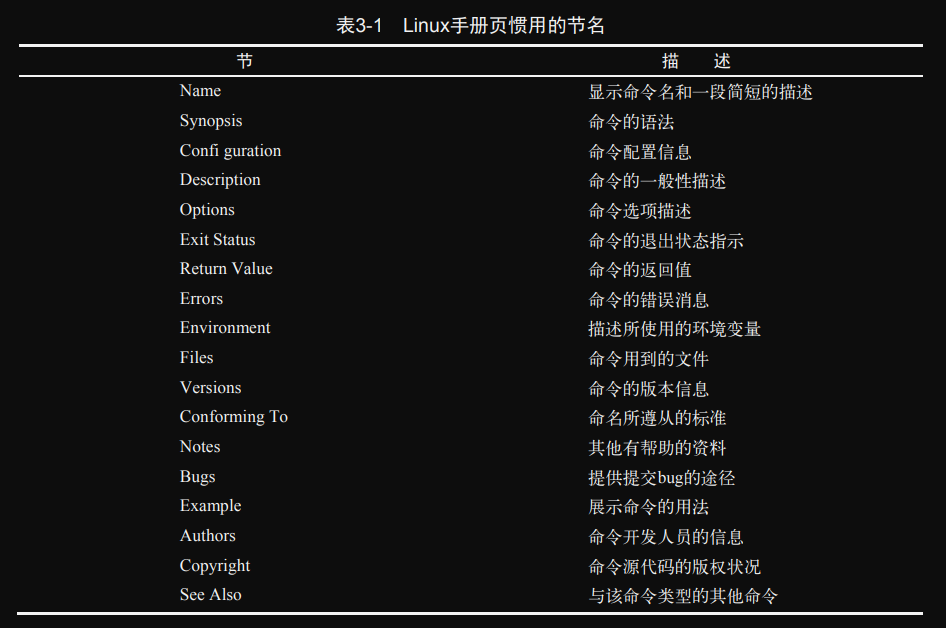
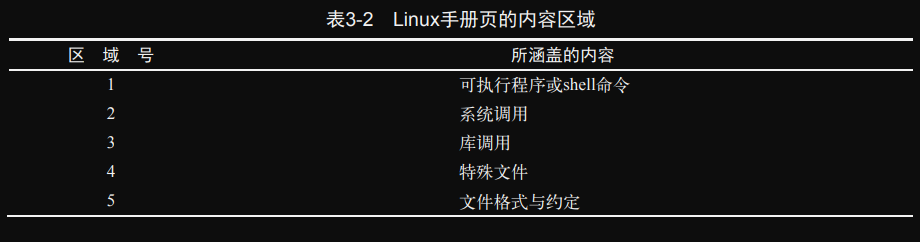
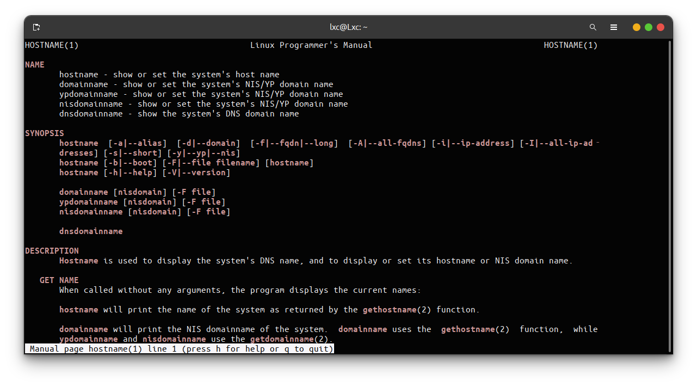
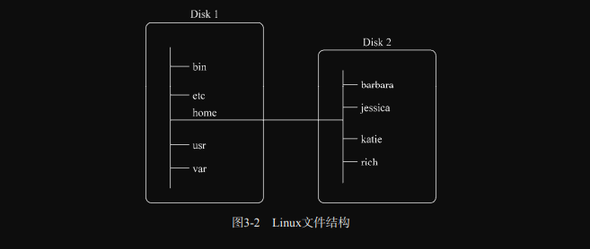
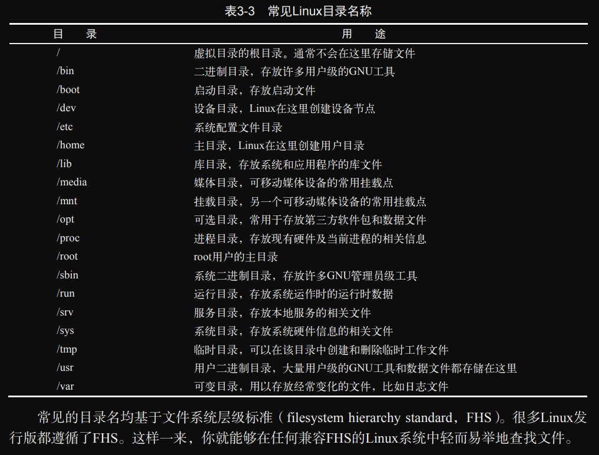

# ch03 bash shell基础命令

很多Linux发行版的默认shell是GNU bash shell。本章将介绍bash shell的基本特性，比如bash手册、命令行补全以及如何显示文件内容。我们会带你逐步了解怎样用bash shell提供的基础命令来处理Linux文件和目录（~~我骗你的，我会跳过很多基础，这一章是为了完整性出的。。。~~）

## 1. shell！！启动！！！！！！

GNU bash shell是一个程序，提供了对Linux系统的交互式访问。它是作为普通程序运行的，通常是在用户登录终端时启动。系统启动的shell程序取决于用户帐户的配置。  
*/etc/passwd* 文件包含了所有系统用户帐户以及每个用户的基本配置信息。下面是从 */etc/passwd* 文件中摘取的样例条目：

```bash
lxc@Lxc:~/scripts/ch03-bash shell基础命令$ cat /etc/passwd | grep lxc
lxc:x:1000:1000:Lxc,,,:/home/lxc:/bin/bash
```

其中，每个条目包含7个字段，字段之间使用冒号作为分隔。最后一个字段指定了该用户使用的shell程序。lxc用户使用的是/bin/bash。  
尽管bash shell会在登陆时自行启动，但是否会出现命令行界面（CLI）取决于所使用的登录方式。如果采用的是虚拟控制台终端登录，那么CLI提示符会自动出现，接受shell命令输入。但如果是通过图形化桌面环境登录Linux系统，则需要启动图形化终端仿真器来访问shell CLI提示符（你多半用的是图形化桌面环境，按Ctrl+Alt+t就行了）。

## 2. 使用shell提示符

shell提示符并非是一成不变的。你可以根据需要修改提示符（通过 `PS1` 环境变量）。shell CLI提示符用于告诉你什么时候shell可以接受新的命令。

## 3. 与bash手册交互

手册页将与命令相关的信息分成了多段。每一段的惯用名称标准如下表所示。



如果不记得命令名了，可以使用关键字来搜索手册页。语法为 `man -k keyword`。例如，要查找与终端相关的命令，可以输入 `man -k terminal`。  

除了按照惯例命名的各段，手册页还有不同的节。每节都分配了一个数字，从1开始，一直到9，如下表所示。




`man` 命令通常显示的是指定命令的最低的节。例如，我们在下图中输入的是 `man hostname`，注意在显示内容的左上角和右上角，单词 `HOSTNAME` 后的圆括号中有一个数字：（1）。这表示所显示的手册页来自第1节（可执行程序或shell命令）。



> **注意：** 你的Linux系统手册页可能包含一些非标准的节编号。例如 1p 对应于可移植操作系统接口（portable operating system interface，POSIX）命令，3n 对应于网络函数。  

一个命令偶尔会在多个节中都有对应的手册页。比如，`hostname` 命令的手册页既包含该命令的相关信息，也包括对系统主机名的概述。要想查看所需的页面，可以使用下面格式的命令： 

```bash
man section# topicname
```

因此，输入 `man 7 hostname`，可以查看手册页中的第7节。也可以使用 `man -a hostname`，你用一次就知道了。  
你也可以只看各节内容的简介：输入 `man 1 intro` 阅读第1节的简介（就是说明手册页的第一节一般会放置什么样的内容）；`man 2 intro` 阅读第2节的简介；......`man 8 intro` 阅读第8节的简介。  
输入 `man man` 来查看与手册页相关的信息。  
手册页并非唯一的参考资料。还有另一种称作 `info` 页面的信息。可以输入 `info info` 来了解 info 页面的相关内容。  
内建命令有自己的帮助页面。有关帮助页面的的更多信息可以输入 `help help` 来了解。  
另外，大多数命令接受 `-h` 或 `--help` 选项。例如，可以输入 `hostname --help` 来查看简要的帮助信息。  

## 4. 浏览文件系统

### *1. Linux文件系统*

Linux会将文件存储在名为 **虚拟目录（virtual directory）** 的单个目录结构中。虚拟目录会将计算机中所有存储设备的文件路径都纳入单个目录结构。  
Linux虚拟目录结构只包含一个称为 **根（root）** 目录的基础目录。根目录下的目录和文件会按照其访问路径一一列出，路径本身并没有提供任何有关文件究竟存放在哪个物理磁盘中的信息。  
Linux虚拟目录中比较复杂的部分是它如何来协调管理各个存储设备。我们称在Linux系统中安装的第一块硬盘为 **根驱动器**。根驱动器包含了虚拟目录的核心，其他目录都是从那里开始构建的。  
Linux会使用根驱动器上一些特别的目录作为 **挂载点（mount point）**。挂载点是虚拟目录中分配给额外存储设备的目录。Linux会让文件和目录出现在这些挂载点目录中，即便它们位于其他物理驱动器中。  
系统文件通常存储在根驱动器中，而用户文件则存储在其它存储器中。如下图所示。  



上图展示了计算机中的两块硬盘。一块硬盘（Disk 1）与虚拟目录的根目录关联。其他硬盘可以挂载到虚拟目录结构中的任何地方。在这个例子中，另一块硬盘（Disk 2）被挂载到了 /home，这是用户主目录所在的位置。  
Linux文件系统演进自Unix文件系统。在Linux文件系统中，采用通用的目录名表示一些常见的功能。下表列出了一些较常见的Linux顶层虚拟目录名及其内容。



### 2. 遍历目录

在Linux文件系统中，你可以使用目录切换（ `cd` ）命令来将shell会话切换到另一个目录。`cd` 命令的语法非常简单：

```bash
cd destination
```

`cd` 命令可以接受单个参数的 *destination*，用以指定你想切换到的目录名。如果没有为 `cd` 命令指定目标路径，则会切换到你的用户主目录。  
*destination* 参数可以用两种方法表示，一种是绝对路径，一种是相对路径。  

#### *1. 绝对路径*

**绝对路径** 总是以正斜线开始，以指明虚拟文件系统的根目录。

#### *2. 相对路径*

**相对路径** 允许你指定一个基于当前位置的目标路径。相对路径不以代表根目录的正斜线开头，而是以目录名（如果你准备切换到当前目录下的某个目录的话）或是一个特殊字符开始。

有两个特殊字符可以用于相对路径中。

- 单点号（.），表示当前目录
- 双点号（..），表示当前目录的父目录

## 5. 列出文件和目录

本节将讲述 `ls` 命令和可用来格式化其输出信息的选项。

### *1. 显示基本列表*

`ls` 命令最基本的形式会显示当前目录下的文件和目录。

```bash
lxc@Lxc:~/scripts/ch03-bash shell基础命令$ ls
directory.png  fs.png  hsotname.png  man.png  README.md  section1.png  section2.png
```

注意，`ls` 命令输出的列表是按字母排序的（按列而不是按行排序）。如果你使用终端仿真器支持色彩显示，那么 `ls` 命令还可以用不同的颜色来区分不同类型的文件。`LS_COLORS` 环境变量（[第6章](../ch06-Linux环境变量/README.md)会介绍环境变量）控制着这个特性。不同的Linux发行版会根据各自终端仿真器的能力来设置该环境变量。  
也可以使用 `ls` 命令的 `-F` 选项来轻松地区分文件和目录。使用 `-F` 选项会得到以下输出：

```bash
lxc@Lxc:~$ ls -F
1.txt*   模板/  图片/  下载/  桌面/  C++/ 
```

`-F` 选项会在目录名之后添加正斜线，以方便用户在输出中分辨。类似地，它还会在可执行文件之后添加星号（如上面的1.txt）。  
Linux经常使用 **隐藏文件** 来保存配置信息。在Linux中，隐藏文件通常是文件名以点号开始的文件。这些文件并不会在 `ls` 命令的默认输出中出现。因此，我们称其为隐藏文件。要显示隐藏文件，可以使用 `-a` 选项。

```bash
lxc@Lxc:~$ ls -a
.       .bash_aliases  .dbus       Go          .mysql_history     .redhat                    .themes
..      .bash_history  .designer   .gtkrc-2.0  .npm               .rediscli_history          .thunderbird
公共的  .bashrc        Documents   .icons      .nvm               .ros                       tt
```

`-R` 是递归选项，可以列出当前目录及其子目录所包含的文件和目录。

### *2. 显示长列表*

`ls` 命令 `-l` 选项可以显示长列表格式的输出。

```bash
lxc@Lxc:~$ ls -lF
总用量 96
drwxr-xr-x  2 lxc lxc 4096 6月   8 17:04 公共的/
drwxr-xr-x  2 lxc lxc 4096 12月  1 12:10 模板/
drwxr-xr-x  2 lxc lxc 4096 6月  26 20:36 视频/
drwxrwxr-x  5 lxc lxc 4096 12月  1 21:27 图片/
drwxr-xr-x  4 lxc lxc 4096 10月 22 12:07 文档/
drwx------ 36 lxc lxc 4096 12月  1 12:11 下载/
drwxr-xr-x  2 lxc lxc 4096 6月   8 17:04 音乐/
drwxr-xr-x  2 lxc lxc 4096 12月  1 12:10 桌面/
```

输出的第一行显示了为该目录中的文件所分配的总块数。此后的每一行都包含了关于文件或目录的下列信息。

- 文件类型，比如目录（d）、文件（-）、链接文件（l）、字符设备（c）、块设备（b）
- 文件的权限（参见[第7章](../ch07-理解Linux文件权限/README.md)）
- 文件的硬链接数（参见[3.6.4](./README.md#4-链接文件)） 
- 文件属主
- 文件属组
- 文件大小（以字节为单位）
- 文件的上次修改时间
- 文件名或目录名

如果想查看单个文件的长列表，那么只需在 `ls -l` 命令之后跟上该文件名即可。如果想查看目录的相关信息，而非目录所包含的内容，则除了 `-l` 选项之外，还得添加 `-d` 选项。即 `ls -ld Directory-Name`。

```bash
lxc@Lxc:~$ ls -ld tt/
drwxrwxr-x 2 lxc lxc 4096 11月 29 14:44 tt/
```

### *3. 过滤输出列表*

当指定特定的文件名作为过滤器时，`ls` 命令只显示该文件的信息。有时你可能不知道要找的那个文件的确切名称。`ls` 命令也能识别标准通配符。

- 问号(?)代表任意单个字符
- 星号(*)代表零个或多个字符

问号可以代表过滤器字符串中任意位置的单个字符。

```bash
lxc@Lxc:~/tt$ ls
fall  fell  fill  full  my_file  my_scrapt  my_script
lxc@Lxc:~/tt$ ls -l my_scr?pt
-rw-rw-r-- 1 lxc lxc 0 12月  2 11:41 my_scrapt
-rw-rw-r-- 1 lxc lxc 0 12月  2 11:41 my_script
```

星号可用来匹配零个或多个字符。

```bash
lxc@Lxc:~/tt$ ls my*
my_file  my_scrapt  my_script
```

在过滤器中使用星号和问号被称作 **通配符匹配（globbing）**，是指使用通配符进行模式匹配的过程。通配符正式的名称叫做 **元字符通配符（metacharacter wildcard）**。除了星号和问号，还有更多的元字符通配符可做文件匹配之用。

> 这里说明一下 globbing 和 wildcard 的区别：globbing 是对 wildcard 进行扩展的过程。在贝尔实验室诞生的Unix中，有一个名为 glob(global的简写) 的独立程序(/etc/glob)。早期的Unix版本（第1～6版，1960年～1975年）的命令解释器（也就是shell）都要依赖于该程序扩展命令中未被引用的 wildcard，然后将扩展后的结果传给命令执行。因此，本书将 globbing 译作 "通配符匹配"（也就是展开命令的过程），将 "wildcard" 译作 "通配符"。

关于通配符与正则表达式，参见[第20章](../ch20-正则表达式/README.md#1-定义)。

可以试试方括号，方括号代表单个字符位置上的多个可能的选择：

```bash
lxc@Lxc:~/tt$ touch my_scrypt
lxc@Lxc:~/tt$ ls -l my_scr[ay]pt
-rw-rw-r-- 1 lxc lxc 0 12月  2 11:41 my_scrapt
-rw-rw-r-- 1 lxc lxc 0 12月  2 11:48 my_scrypt
```

你可以像上面那样将可能的字符逐一列出，也可以指定字符范围，比如字母范围[a-i]：

```bash
lxc@Lxc:~/tt$ ls -l f*ll
-rw-rw-r-- 1 lxc lxc 0 12月  2 11:41 fall
-rw-rw-r-- 1 lxc lxc 0 12月  2 11:41 fell
-rw-rw-r-- 1 lxc lxc 0 12月  2 11:41 fill
-rw-rw-r-- 1 lxc lxc 0 12月  2 11:41 full
lxc@Lxc:~/tt$ ls -l f[a-i]ll
-rw-rw-r-- 1 lxc lxc 0 12月  2 11:41 fall
-rw-rw-r-- 1 lxc lxc 0 12月  2 11:41 fell
-rw-rw-r-- 1 lxc lxc 0 12月  2 11:41 fill
```

还可以使用惊叹号（!）来将不需要的内容排除：

```bash
lxc@Lxc:~/tt$ ls -l f[!a]ll
-rw-rw-r-- 1 lxc lxc 0 12月  2 11:41 fell
-rw-rw-r-- 1 lxc lxc 0 12月  2 11:41 fill
-rw-rw-r-- 1 lxc lxc 0 12月  2 11:41 full
```

## 6. 处理文件

本节将带你逐步了解文件处理所需要的一些基本的shell命令。

### *1. 创建文件*

`touch` 命令可以创建空文件。该命令会将你的用户名作为文件的属主。  
`touch` 命令还可以用来改变文件的修改时间。该操作不会改变文件内容。

```bash
lxc@Lxc:~/tt$ ls -l fall 
-rw-rw-r-- 1 lxc lxc 0 12月  2 11:41 fall
lxc@Lxc:~/tt$ touch fall 
lxc@Lxc:~/tt$ ls -l fall 
-rw-rw-r-- 1 lxc lxc 0 12月  2 12:03 fall
```

### *2. 复制文件*

`cp` 命令最基本的用法只需要两个参数，即源对象和目标对象：`cp source destination`。当参数 *source* 和 *destination* 都是文件名时，`cp` 命令会将源文件复制成一个新的目标文件，并以 *destination* 命名。新文件在形式上就像全新文件一样，有新的修改时间。

```bash
lxc@Lxc:~/tt$ ls
fall  fell  fill  full  my_file  my_scrapt  my_script  my_scrypt  test_one
lxc@Lxc:~/tt$ cp test_one test_two
lxc@Lxc:~/tt$ ls -l test_one test_two 
-rw-rw-r-- 1 lxc lxc 0 12月  2 14:38 test_one
-rw-rw-r-- 1 lxc lxc 0 12月  2 14:39 test_two
```

如果目标文件已经存在，则 `cp` 命令可能并不会提醒你这一点。最好加上 `-i` 选项，强制shell询问是否需要覆盖某个已有文件：

```bash
lxc@Lxc:~/tt$ cp -i test_one test_two
cp：是否覆盖'test_two'？ n
```

如果不回答 y ，则停止文件复制。  

*看几个例子吧：*

```bash
lxc@Lxc:~/tt$ mkdir Documents
lxc@Lxc:~/tt$ ls -F
Documents/  fall  fell  fill  full  my_file  my_scrapt  my_script  my_scrypt  test_one  test_two
lxc@Lxc:~/tt$ cp test_one Documents/
lxc@Lxc:~/tt$ cp test_two /home/lxc/tt/Documents/
lxc@Lxc:~/tt$ cd Documents/
lxc@Lxc:~/tt/Documents$ cp ../fall .
lxc@Lxc:~/tt/Documents$ ls
fall  test_one  test_two
lxc@Lxc:~/tt/Documents$ 
```

`-R` 选项可以在单个命令中递归地复制整个目录的内容。

```bash
lxc@Lxc:~/tt$ cp -R Documents/ NewDocuments/
lxc@Lxc:~/tt$ ls -F
Documents/  fall  fell  fill  full  my_file  my_scrapt  my_script  my_scrypt  NewDocuments/  test_one  test_two
lxc@Lxc:~/tt$ ls -lF NewDocuments/
总用量 0
-rw-rw-r-- 1 lxc lxc 0 12月  2 14:51 fall
-rw-rw-r-- 1 lxc lxc 0 12月  2 14:51 test_one
-rw-rw-r-- 1 lxc lxc 0 12月  2 14:51 test_two
```

在执行 `cp -R` 命令之前，*NewDocuments* 目录并不存在。它是随着 `cp -R` 命令被创建的，整个 *Documents* 目录的内容都被复制到其中。注意，新的 *NewDocuments* 目录中的所有文件都有对应的新日期。

也可以在 `cp` 命令中使用通配符。

```bash
lxc@Lxc:~/tt$ ls
Documents  fall  fell  fill  full  my_file  my_scrapt  my_script  my_scrypt  NewDocuments  test_one  test_two
lxc@Lxc:~/tt$ cp my* NewDocuments/
lxc@Lxc:~/tt$ ls -lF NewDocuments/
总用量 0
-rw-rw-r-- 1 lxc lxc 0 12月  2 14:51 fall
-rw-rw-r-- 1 lxc lxc 0 12月  2 14:55 my_file
-rw-rw-r-- 1 lxc lxc 0 12月  2 14:55 my_scrapt
-rw-rw-r-- 1 lxc lxc 0 12月  2 14:55 my_script
-rw-rw-r-- 1 lxc lxc 0 12月  2 14:55 my_scrypt
-rw-rw-r-- 1 lxc lxc 0 12月  2 14:51 test_one
-rw-rw-r-- 1 lxc lxc 0 12月  2 14:51 test_two
```

### *3. 命令行补全*

使用制表键补全的技巧在于要给shell提供足够的文件名信息，使其能够将所需文件与其他文件名区分开来。连按两下可以看当前的匹配结果：

```bash
lxc@Lxc:~/tt$ ls f # 这里连按了两下制表键
fall  fell  fill  full  
lxc@Lxc:~/tt$ ls f
```

### *4. 链接文件*

在Linux中有两种类型的文件链接。

- 符号链接
- 硬链接

**符号链接（软链接）** 是一个实实在在的文件，该文件指向存放在虚拟目录结构中某个地方的另一个文件。要为一个文件创建一个符号链接，原始文件必须存在。然后可以使用 `ln` 命令以及 `-s` 选项来创建符号链接。

```bash
lxc@Lxc:~/tt$ ls -l test_file 
-rw-rw-r-- 1 lxc lxc 68 12月  2 15:08 test_file
lxc@Lxc:~/tt$ ln -s test_file slink_test_file
lxc@Lxc:~/tt$ ls -l *test_file
lrwxrwxrwx 1 lxc lxc  9 12月  2 15:08 slink_test_file -> test_file
-rw-rw-r-- 1 lxc lxc 68 12月  2 15:08 test_file
```

在这个例子中，注意符号链接文件名 *slink_test_file* 位于 `ln` 命令的第二个参数。长列表（`ls -l`）中显示的符号文件名后的->符号表示该文件是链接到文件 *test_file* 的一个符号链接。  
另外，还要注意符号链接文件与数据文件的大小。符号链接文件 *slink_test_file* 只有9个字节，而 *test_file* 有68个字节。这是因为 *slink_test_file* 仅仅是指向 *test_file* 而已，它们的内容并不相同。  
另一种证明链接文件是一个独立文件的方法是查看inode编号。文件或目录的inode编号是内核分配给文件系统中每一个对象的唯一标识。要查看文件或目录的inode编号，可以使用 `ls` 命令的 `-i` 选项。

```bash
lxc@Lxc:~/tt$ ls -li *test_file
1713477 lrwxrwxrwx 1 lxc lxc  9 12月  2 15:08 slink_test_file -> test_file
1718916 -rw-rw-r-- 1 lxc lxc 68 12月  2 15:08 test_file
```

两者的inode编号不同，所以说两者是不同的文件。  

修改已存在的软连接，可以使用 `ln` 命令的 `-f` 选项。如果软链接文件已经存在的情况下，`-f` 选项会移除该软链接文件，创建新的同名文件。或者使用 `-i` 选项，该选项会询问是否覆盖已存在文件。  
修改 *slink_test_file* 文件，使其指向 *test_file2* 文件。

```bash
lxc@Lxc:~/tt$ ln -sf test_file2 slink_test_file 
lxc@Lxc:~/tt$ ls -li
总用量 8
1719135 lrwxrwxrwx 1 lxc lxc 10 12月  2 15:31 slink_test_file -> test_file2
1718916 -rw-rw-r-- 1 lxc lxc 68 12月  2 15:08 test_file
1719212 -rw-rw-r-- 1 lxc lxc 44 12月  2 15:20 test_file2
# 
lxc@Lxc:~/tt$ ln -si test_file slink_test_file 
ln：是否替换'slink_test_file'？ y
lxc@Lxc:~/tt$ ls -li
总用量 8
1713477 lrwxrwxrwx 1 lxc lxc  9 12月  2 15:33 slink_test_file -> test_file
1718916 -rw-rw-r-- 1 lxc lxc 68 12月  2 15:08 test_file
1719212 -rw-rw-r-- 1 lxc lxc 44 12月  2 15:20 test_file2
```

软链接也可以链接到目录。为此，要使用 `ln` 命令的 `-n` 选项。`-n` 选项会将指向目录的软链接视为普通文件。

```bash
lxc@Lxc:~/tt$ ls -liF
总用量 12
2117992 drwxrwxr-x 2 lxc lxc 4096 12月  2 15:36 Documents/
1713477 lrwxrwxrwx 1 lxc lxc    9 12月  2 15:33 slink_test_file -> test_file
1718916 -rw-rw-r-- 1 lxc lxc   68 12月  2 15:08 test_file
1719212 -rw-rw-r-- 1 lxc lxc   44 12月  2 15:20 test_file2
lxc@Lxc:~/tt$ ln -snf Documents/ slink_test_file
lxc@Lxc:~/tt$ ls -li
总用量 12
2117992 drwxrwxr-x 2 lxc lxc 4096 12月  2 15:36 Documents
1719135 lrwxrwxrwx 1 lxc lxc   10 12月  2 15:37 slink_test_file -> Documents/
1718916 -rw-rw-r-- 1 lxc lxc   68 12月  2 15:08 test_file
1719212 -rw-rw-r-- 1 lxc lxc   44 12月  2 15:20 test_file2
```

**硬链接** 创建的是一个独立的虚拟文件，其中包含了原始文件的信息以及位置。但两者就根本而言是同一个文件。要想创建硬链接，原始文件也必须事先存在，只不过这次使用 `ln` 命令时，不需要再加入额外的选项了。

```bash
lxc@Lxc:~/tt$ ls -li
总用量 12
1718916 -rw-rw-r-- 1 lxc lxc   68 12月  2 15:08 test_file
lxc@Lxc:~/tt$ ln test_file hlink_test_file
lxc@Lxc:~/tt$ ls -li
总用量 16
1718916 -rw-rw-r-- 2 lxc lxc   68 12月  2 15:08 hlink_test_file
1718916 -rw-rw-r-- 2 lxc lxc   68 12月  2 15:08 test_file
```

注意，以硬链接相连的文件共享同一个inode编号。这是因为两者其实就是同一个文件。另外，两者的文件的大小也一样。

> **注意：** 只能对处于同一存储设备的文件创建硬链接。要想在位于不同存储设备的文件之间创建链接，只能使用符号链接（也就是说硬链接不能跨文件系统，软链接可以跨文件系统）。

### *5. 文件重命名*

在Linux中，重命名文件称为 **移动（moving）**。`mv` 命令可以将文件或目录从一个位置移动到另一个位置同时/或是重命名。

重命名文件：

```bash
lxc@Lxc:~/tt$ ls -li
总用量 16
2117992 drwxrwxr-x 2 lxc lxc 4096 12月  2 15:38 Documents
1718916 -rw-rw-r-- 2 lxc lxc   68 12月  2 15:08 hlink_test_file
1719135 lrwxrwxrwx 1 lxc lxc   10 12月  2 15:44 slink_test_file -> Documents/
1718916 -rw-rw-r-- 2 lxc lxc   68 12月  2 15:08 test_file
1719212 -rw-rw-r-- 1 lxc lxc   44 12月  2 15:20 test_file2
lxc@Lxc:~/tt$ mv test_file test_file0
lxc@Lxc:~/tt$ ls -li
总用量 16
2117992 drwxrwxr-x 2 lxc lxc 4096 12月  2 15:38 Documents
1718916 -rw-rw-r-- 2 lxc lxc   68 12月  2 15:08 hlink_test_file
1719135 lrwxrwxrwx 1 lxc lxc   10 12月  2 15:44 slink_test_file -> Documents/
1718916 -rw-rw-r-- 2 lxc lxc   68 12月  2 15:08 test_file0
1719212 -rw-rw-r-- 1 lxc lxc   44 12月  2 15:20 test_file2
```

*test_file* 文件名改为了 *test_file0*。注意，inode编号和时间戳保持不变。这是因为 `mv` 只影响文件名。

也可用 `mv` 来移动文件的位置，或者在移动文件位置的同时重命名：

```bash
lxc@Lxc:~$ mkdir tt2
lxc@Lxc:~$ mv tt/test_file0 tt2/
lxc@Lxc:~$ ls -li tt2/
总用量 4
1718916 -rw-rw-r-- 2 lxc lxc 68 12月  2 15:08 test_file0
lxc@Lxc:~$ mv tt/test_file2 tt2/test_file2_
lxc@Lxc:~$ ls -li tt2/
总用量 8
1718916 -rw-rw-r-- 2 lxc lxc 68 12月  2 15:08 test_file0
1719212 -rw-rw-r-- 1 lxc lxc 44 12月  2 15:20 test_file2_
lxc@Lxc:~$ ls -li tt/
总用量 8
2117992 drwxrwxr-x 2 lxc lxc 4096 12月  2 15:38 Documents
1718916 -rw-rw-r-- 2 lxc lxc   68 12月  2 15:08 hlink_test_file
1719135 lrwxrwxrwx 1 lxc lxc   10 12月  2 15:44 slink_test_file -> Documents/
```

注意，同样的只是文件的位置和名称发生了改变。时间戳与inode编号均未发生改变。  

移动目录也是同理：

```bash
lxc@Lxc:~$ ls -ldi tt2/
2118044 drwxrwxr-x 2 lxc lxc 4096 12月  2 16:02 tt2/
lxc@Lxc:~$ mv tt2/ tt/
lxc@Lxc:~$ ls -liF tt/
总用量 12
2117992 drwxrwxr-x 2 lxc lxc 4096 12月  2 15:38 Documents/
1718916 -rw-rw-r-- 2 lxc lxc   68 12月  2 15:08 hlink_test_file
1719135 lrwxrwxrwx 1 lxc lxc   10 12月  2 15:44 slink_test_file -> Documents//
2118044 drwxrwxr-x 2 lxc lxc 4096 12月  2 16:02 tt2/
# 在移动的同时重命名目录
lxc@Lxc:~$ mv tt/tt2/ ./tt0
lxc@Lxc:~$ ls -lid tt0/
2118044 drwxrwxr-x 2 lxc lxc 4096 12月  2 16:02 tt0/
```

> **提示：** 和 `cp` 命令、`ln` 命令一样，你也可以在 `mv` 命令中加入 `-i` 选项，这样在 `mv` 命令试图覆盖已存在的文件或目录时会发出询问。

### *6. 删除文件*

在Linux中，删除（deleting）叫作 **移除（removing）**。bash shell中用于移除文件的命令是 `rm`。

`rm` 命令非常简单：

```bash
lxc@Lxc:~/tt$ ls
fall  fell  fill  full
lxc@Lxc:~/tt$ rm -i fall
rm：是否删除普通空文件 'fall'？ y
lxc@Lxc:~/tt$ ls
fell  fill  full
```

同样，`-i` 选项会询问你是否删除该文件。shell没有回收站或垃圾箱这样的东西，文件一旦被删除，就再也找不回来了。  
也可以使用通配符删除一组文件。

```bash
lxc@Lxc:~/tt$ rm -i f?ll
rm：是否删除普通空文件 'fell'？ y
rm：是否删除普通空文件 'fill'？ y
rm：是否删除普通空文件 'full'？ y
lxc@Lxc:~/tt$ ls
lxc@Lxc:~/tt$ 
```

如果你要删除很多文件，又不想被命令提示符干扰，可以使用 `-f` 选项来强制删除。

## 7. 管理目录

在Linux中，有些命令（比如 `cp` 命令）对文件和目录都有效，有些命令则只对目录有效。这节讲讲目录的增删。

### *1. 创建目录*

不多bb了。

```bash
lxc@Lxc:~/tt$ mkdir New_dir
lxc@Lxc:~/tt$ ls -lid New_dir/
2117812 drwxrwxr-x 2 lxc lxc 4096 12月  2 16:25 New_dir/
lxc@Lxc:~/tt$ mkdir -p New_dir2/New_dir3
lxc@Lxc:~/tt$ ls -RlFi
.:
总用量 8
2117812 drwxrwxr-x 2 lxc lxc 4096 12月  2 16:25 New_dir/
2117823 drwxrwxr-x 3 lxc lxc 4096 12月  2 16:26 New_dir2/

./New_dir:
总用量 0

./New_dir2:
总用量 4
2117825 drwxrwxr-x 2 lxc lxc 4096 12月  2 16:26 New_dir3/
```

### *2. 删除目录*

也不想bb了。

```bash
lxc@Lxc:~/tt$ ls
New_dir  New_dir2
lxc@Lxc:~/tt$ rmdir New_dir # 注，New_dir 目录为空，所以可使用该命令直接删除
lxc@Lxc:~/tt$ ls
New_dir2
lxc@Lxc:~/tt$ rmdir New_dir2/
rmdir: 删除 'New_dir2/' 失败: 目录非空
lxc@Lxc:~/tt$ rm -r New_dir2/
lxc@Lxc:~/tt$ ls
lxc@Lxc:~/tt$ 
```

对于 `rm` 命令 `-R` 和 `-r` 选项的效果是一样，都可以递归地删除目录中的文件。  
粗暴点的话，就使用 `rm -rf` 就行，不过要小心点。

## 8. 查看文件内容

### *1. 查看文件类型*

`file` 命令是一个方便的小工具，能够探测文件的内部并判断文件类型。

```bash
lxc@Lxc:~$ file .bashrc 
.bashrc: UTF-8 Unicode text
```

`file` 命令不仅能够确定文件包含的是文本信息，还能确定该文件的字符编码是UTF-8。

```bash
lxc@Lxc:~$ file tt0/
tt0/: directory
lxc@Lxc:~/tt$ file slink_test_file 
slink_test_file: symbolic link to test_file
lxc@Lxc:~/scripts/ch13-更多的结构化命令$ file test10.sh 
test10.sh: Bourne-Again shell script, ASCII text executable
lxc@Lxc:~/scripts/ch13-更多的结构化命令$ file /usr/bin/ls
/usr/bin/ls: ELF 64-bit LSB shared object, x86-64, version 1 (SYSV), dynamically linked, interpreter /lib64/ld-linux-x86-64.so.2,.....省略
```

### 2. 查看整个文件

Linux有3个命令来完成这个任务。

#### *1. `cat` 命令*

```bash
lxc@Lxc:~/tt$ cat test_file 
This is the first line.
This is the second line.
This is the third line.

This is the last line.
```

`-n` 选项会给所有行加上行号。

```bash
lxc@Lxc:~/tt$ cat -n test_file 
     1	This is the first line.
     2	This is the second line.
     3	This is the third line.
     4	
     5	This is the last line.
```

`-b` 选项会给有文本的行加上行号。

```bash
lxc@Lxc:~/tt$ cat -b test_file 
     1	This is the first line.
     2	This is the second line.
     3	This is the third line.

     4	This is the last line.
```

#### *2. `more` 命令*

`more` 命令是一个分页工具，只支持文本文件中基本的移动。如果想要更多的高级特性，可以使用 `less` 命令。

#### *3. `less` 命令*

`less` 命令为 `more` 命令的升级版。提供了多个非常实用的特性，能够实现在文本文件中前后翻动，还有一些高级搜索功能。  
`less` 命令还可以完成在整个文件的读取之前显示文件的内容。`cat` 命令和 `more` 命令则无法做到这一点。  
`less` 命令通常为手册页提供分页服务。你对 `less` 了解的越多，阅读各种命令手册页的时候就越得心应手。更多选项请查看 `less` 命令的手册页。

### 3. 查看部分文件

#### *1. `tail` 命令*

默认情况下，`tail` 命令会显示文件的末尾10行内容。

`-n` 选项可以修改所显示的行数。例如 `-n 2` 就是只显示最后2行。

```bash
lxc@Lxc:~$ cat /etc/passwd | wc -l
57
lxc@Lxc:~$ tail -n 2 /etc/passwd
_rpc:x:134:65534::/run/rpcbind:/usr/sbin/nologin
nobody:x:65534:65534::/nonexistent:/usr/sbin/nologin
```

`-n digit` 在 *digit* 前可以加一个加号，表示从第几行直到末尾。例如 `-n +50` 是从第50行（included）到末尾。

```bash
lxc@Lxc:~$ tail -n +50 /etc/passwd
mysql:x:130:137:MySQL Server,,,:/nonexistent:/bin/false
consul:x:998:997::/home/consul:/bin/false
kong:x:1001:1001:Kong default user:/home/kong:/bin/sh
postgres:x:131:138:PostgreSQL administrator,,,:/var/lib/postgresql:/bin/bash
nginx:x:132:140:nginx user,,,:/nonexistent:/bin/false
sshd:x:133:65534::/run/sshd:/usr/sbin/nologin
_rpc:x:134:65534::/run/rpcbind:/usr/sbin/nologin
nobody:x:65534:65534::/nonexistent:/usr/sbin/nologin
```

**`tail` 命令有一个实用的特性：`-f` 选项**，该选项允许你在其他进程使用此文件时查看文件的内容，`tail` 命令会保持活动状态并持续显示添加到文件中的内容。这是实时检测系统日志的绝佳方式。

*来个例子：*

该示例的脚本文件参考[test1.sh](./test1.sh)

```bash
lxc@Lxc:~/scripts/ch03-bash shell基础命令$ . test1.sh 
2023-12-02 17:39:07
2023-12-02 17:39:12
2023-12-02 17:39:17
......省略后续每隔5秒增添的输出。
# 此时，打开另一个终端，执行如下命令，可以看到输出会不断的跟进。
lxc@Lxc:~/scripts/ch03-bash shell基础命令$ tail -f test.log 
2023-12-02 17:39:12
2023-12-02 17:39:17
2023-12-02 17:39:22
2023-12-02 17:39:27
2023-12-02 17:39:32
2023-12-02 17:39:37
2023-12-02 17:39:42
2023-12-02 17:39:47
2023-12-02 17:39:52
2023-12-02 17:39:57
......省略
```

**`-F` 选项相对于 `-f` 选项增加了重试的机制。** 会有这么一种情况，在我们这个脚本中，输出被保存到 *test.log* 文件中。如果我们删除或者重命名了 *test.log* 文件，那么 `-f` 选项就不会继续跟进脚本的输出（即便5秒后，该脚本再次创建了同名的文件）。而 `-F` 选项会重新跟进新出现的同名文件，当原文件丢失时，`-F` 选项还会报告丢失，当同名文件再次出现时，它也会报告并跟进。

```bash
lxc@Lxc:~/scripts/ch03-bash shell基础命令$ . test1.sh 
2023-12-02 17:54:33
2023-12-02 17:54:38
2023-12-02 17:54:43
2023-12-02 17:54:48
2023-12-02 17:54:53
......省略输出
# 在第二个终端上进行跟进
lxc@Lxc:~/scripts/ch03-bash shell基础命令$ tail -F test.log 
2023-12-02 17:40:58
2023-12-02 17:41:03
2023-12-02 17:54:33
2023-12-02 17:54:38
2023-12-02 17:54:43
2023-12-02 17:54:48
2023-12-02 17:54:53
2023-12-02 17:54:58
2023-12-02 17:55:03
2023-12-02 17:55:08
2023-12-02 17:55:13
2023-12-02 17:55:18
2023-12-02 17:55:23
2023-12-02 17:55:28
2023-12-02 17:55:33
2023-12-02 17:55:38
2023-12-02 17:55:43
# 在第三个终端上进行重命名
lxc@Lxc:~/scripts/ch03-bash shell基础命令$ mv test.log test1.log
# 查看第二个终端的输出：
tail: 'test.log' 已不可访问: 没有那个文件或目录
tail: 'test.log' 已被建立；正在跟随新文件的末尾
2023-12-02 17:55:48
2023-12-02 17:55:53
2023-12-02 17:55:58
2023-12-02 17:56:03
```

如你所见，`-F` 选项符合我们预期。  
`-f` 选项不会进行重试：

```bash
lxc@Lxc:~/scripts/ch03-bash shell基础命令$ . test1.sh 
2023-12-02 17:58:50
2023-12-02 17:58:55
2023-12-02 17:59:00
2023-12-02 17:59:05
2023-12-02 17:59:10
2023-12-02 17:59:15
2023-12-02 17:59:20
# 在第二个终端进行跟进
lxc@Lxc:~/scripts/ch03-bash shell基础命令$ tail -f test.log 
2023-12-02 17:55:48
2023-12-02 17:55:53
2023-12-02 17:55:58
2023-12-02 17:56:03
2023-12-02 17:58:50
2023-12-02 17:58:55
2023-12-02 17:59:00
2023-12-02 17:59:05
# 在第三个终端进行重命名
lxc@Lxc:~/scripts/ch03-bash shell基础命令$ mv test.log test2.log
# 查看第二个终端：
没有输出，只有一个闪烁的光标。
```

#### *2. `head` 命令*

默认情况下，`head` 命令会显示文件的前10行文本。`head` 命令没什么好讲的其实，就跟 `more` 相对于 `less` 一样。

`-n` 选项可以修改所显示的行数。`-n 2` 显示前两行。

```bash
lxc@Lxc:~$ head -n 2 /etc/passwd
root:x:0:0:root:/root:/bin/bash
daemon:x:1:1:daemon:/usr/sbin:/usr/sbin/nologin
```

`-n digit`，*digit* 参数前可以加一个负号（-），表示从开头显示到倒数第几行。`head -n -50` 表示从开头显示到倒数第50行（included）。

```bash
lxc@Lxc:~$ head -n -50 /etc/passwd
root:x:0:0:root:/root:/bin/bash
daemon:x:1:1:daemon:/usr/sbin:/usr/sbin/nologin
bin:x:2:2:bin:/bin:/usr/sbin/nologin
sys:x:3:3:sys:/dev:/usr/sbin/nologin
sync:x:4:65534:sync:/bin:/bin/sync
games:x:5:60:games:/usr/games:/usr/sbin/nologin
man:x:6:12:man:/var/cache/man:/usr/sbin/nologin
```