# ch04 更多的bash shell命令

本章会讲解Linux系统管理命令，演示如何通过命令行命令来探查Linux系统的内部信息，然后会讲解一些可用于处理系统数据文件的命令。

## 1. 检测程序

### 1. 探查进程

`ps` 命令默认只显示运行在当前终端中属于当前用户的那些进程。在这个例子中，只有bash shell在运行（记住，shell只是运行在系统中的另一个程序而已），当然 `ps` 命令本身也在运行（这是因为 `ps` 是外部命令，参见 [第5章](../ch05-理解shell/README.md#1-外部命令)）。

```bash
lxc@Lxc:~/scripts/ch04-更多的bash shell命令$ ps
    PID TTY          TIME CMD
   8793 pts/2    00:00:00 bash
  12458 pts/2    00:00:00 ps
```

`ps` 命令的基本输出显示了程序的ID（process ID，PID）、进程运行在哪个终端（TTY）及其占用的CPU时间。

> **注意：** `ps` 命令令人头疼的地方（也正是它如此复杂的原因）在于它曾经有两个版本。每个版本都有自己的一套命令行选项，控制着显示哪些信息以及如何显示。最近Linux开发人员已经将这两种 `ps` 命令格式合并到单个 `ps` 命令中（当然，同时也加入了他们自己的风格）。

Linux系统中使用的 `GNU ps` 命令支持以下3种类型的命令行选项：

- Unix 风格选项，选项前加单连字符
- BSD 风格选项，选项前不加连字符
- GNU 长选项。选项前加双连字符

#### *1. Unix 风格选项*

Unix风格选项源自贝尔实验室开发的 AT&T Unix 系统中的 `ps` 命令。这些选项如下表所示。

(我比较懒。。。)

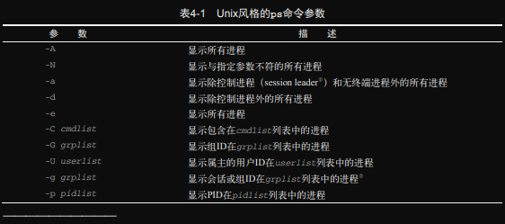
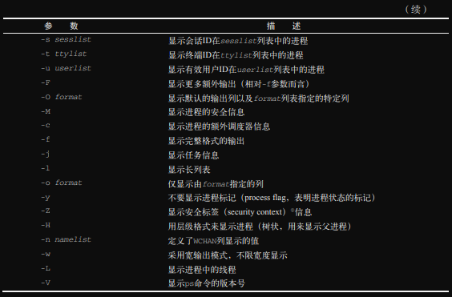

**查看系统中运行的所有进程，常用 `-elf` 选项。**

`-e` 选项指定系统中运行的所有进程。`-f` 选项则扩充输出内容以显示一些有用的信息列。

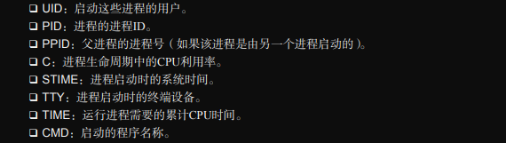

`-l` 选项产生长格式的输出。

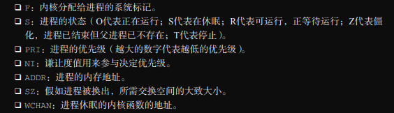

#### *2. BSD风格选项*

伯克利软件发行版（Berkeley Software Distribution，BSD）是加州大学伯克利分校开发的一个Unix版本。BSD与AT&T Unix系统有许多细微的差别，由此引发了多年来的诸多Unix纷争。BSD版的 `ps` 命令选项如下表所示。

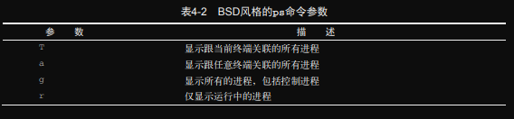
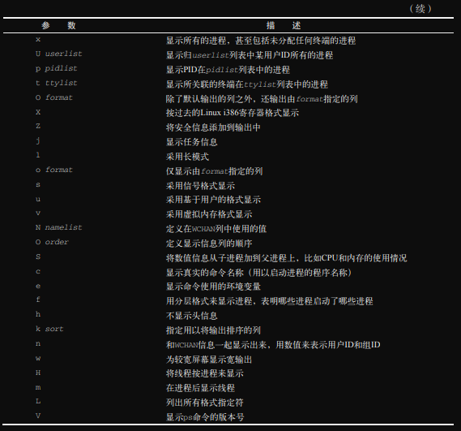

如你所见，Unix和BSD风格的选项有很多的重叠之处。从一种风格的选项中得到的信息基本上也能从另一种风格中获取。  
下面是使用 `l` 选项的输出。

```bash
lxc@Lxc:~$ ps l
F   UID     PID    PPID PRI  NI    VSZ   RSS WCHAN  STAT TTY        TIME COMMAND
4  1000    2252    2152  20   0 164884  6188 do_sys Ssl+ tty2       0:00 /usr/lib/gdm3/gdm-wayland-session env GNOME_SHE
0  1000    2257    2252  20   0 191484 13920 do_sys Sl+  tty2       0:00 /usr/libexec/gnome-session-binary --systemd --s
0  1000    3776    3771  20   0  17944  9000 do_wai Ss   pts/0      0:00 bash
0  1000    4167    4151  20   0  17980  9232 do_sel Ss+  pts/1      0:00 /usr/bin/bash --init-file /usr/share/code/resou
0  1000    4676    4151  20   0  17980  9048 do_sel Ss+  pts/2      0:00 /usr/bin/bash --init-file /usr/share/code/resou
4  1000    5468    3776  20   0  14508  3196 -      R+   pts/0      0:00 ps l
```

下面列出每一列的含义。

- VSZ ：进程占用的虚拟内存的大小（以KB为单位）。
- RSS ：进程在未被交换出时占用的物理内存大小。
- STAT ：代表当前进程状态的多字符状态码。

很多系统管理员喜欢BSD风格的 `l` 选项，因为能输出更详细的进程状态码（STAT列）。多字符状态码能比Unix风格输出的单字符状态码更清楚的表明当前进程的状态。  
第一个字符采用了和Unix风格输出的 S 输出列相同的值，表明进程是在休眠、运行还是等待。第二个字符进一步说明了进程的状态。


从这个例子中可以看出，bash 命令处于休眠状态，同时它也是一个控制进程（会话中的主进程），而 `ps` 命令则运行在系统前台。

#### *3. GNU 长选项*

GNU开发人员在经过改进的新 `ps` 命令中加入了另外一些选项，其中一些GNU长选项复制了现有的Unix或BSD风格选项的效果，而另外一些则提供了新功能。下表列出了可用的GNU长选项。

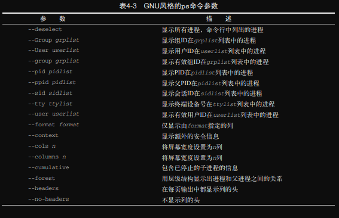
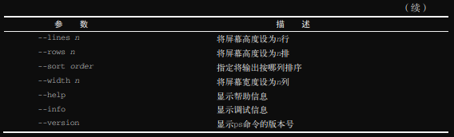

可以混用GNU长选项和Unix或BSD风格的选项来定制输出。作为一个GNU长选项，`--forest` 选项着实讨人喜欢。该选项能够使用ASCII字符来绘制图表以显示进程的层级关系。

```bash
lxc@Lxc:~$ ps -f
UID          PID    PPID  C STIME TTY          TIME CMD
lxc         3776    3771  0 10:59 pts/0    00:00:00 bash
lxc         6886    3776  0 11:28 pts/0    00:00:00 ps -f
lxc@Lxc:~$ bash
lxc@Lxc:~$ bash
lxc@Lxc:~$ ps --forest
    PID TTY          TIME CMD
   3776 pts/0    00:00:00 bash
   6887 pts/0    00:00:00  \_ bash
   7070 pts/0    00:00:00      \_ bash
   7253 pts/0    00:00:00          \_ ps
```

这种格式可以轻易的跟踪子进程和父进程。

### *2. 实时检测进程*

`ps` 命令只能显示特定时间点的信息。`top` 命令也可以显示进程信息，但采用的是实时的方式。

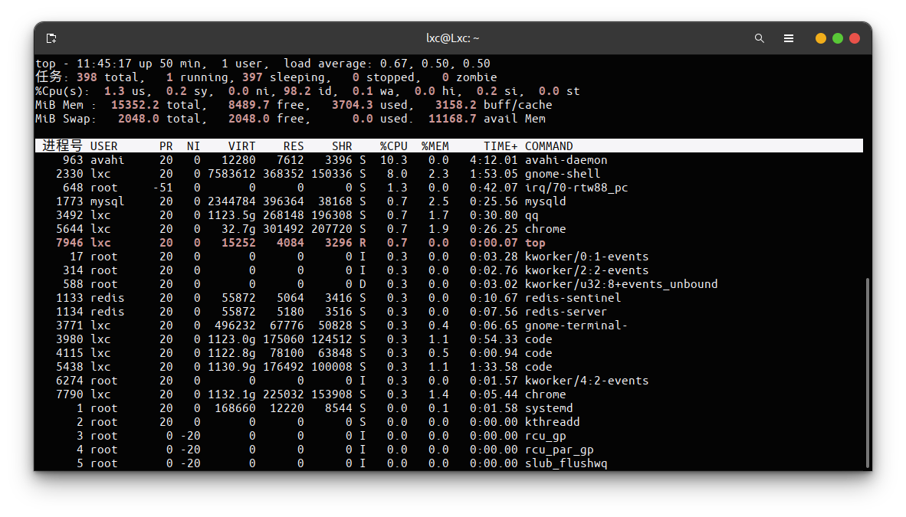

输出的第一部分显示的是系统的概况：第一行显示了当前时间、系统的运行时长、登录的用户数以及系统的平均负载。平均负载有3个值，分别是最近1分钟、最近5分钟和最近15分钟的平均负载。值越大说明系统的负载越高。由于进程短期的突发性活动，出现最近1分钟的高负载值也很常见。但如果最近15分钟内的平均负载都很高，就说明系统可能有问题了。

> **注意：** Linux系统管理员的难点在于定义究竟到什么程度才算是高负载。这个值取决于系统的硬件配置以及系统中通常运行的程序。某个系统的高负载可能对于其他系统来说就是普通水平。最好都做法是注意在正常情况下系统的负载情况，这样更容易判断系统何时负载不足。

第二行显示了进程（`top` 称其为 task）概况：多少进程处于运行、休眠、停止以及僵化状态（僵化状态是指进程已经结束，但其父进程没有响应）。  
第三行显示了CPU概况。`top` 会根据进程的属主（用户还是系统）和进程的状态（运行、空闲或等待）将CPU利用率分成几类输出：

- us ： 用户空间占用CPU百分比
- sy ： 内核空间占用CPU百分比
- ni ： 用户空间内改变过优先级的进程占用CPU百分比
- id ： 空闲CPU时间百分比
- wa ： 等待输入输出的CPU时间百分比
- hi ： 硬件CPU中断占用百分比
- si ： 软中断占用百分比
- st ： 虚拟机占用百分比

第四、五行详细说明了系统内存的状态。前一行显示了系统的物理内存状态：总共有多少内存、当前用了多少、还有多少空闲。后一行显示了系统交换空间（如果分配了的话）的状态。  
最后一部分显示了当前处于运行状态的进程的详细列表，有些列跟 `ps` 命令的输出类似。  

- PID ： 进程的PID
- USER ： 进程属主的用户名
- PR： 进程的优先级
- NI ： 进程的谦让度
- VIRT ： 进程占用的虚拟内存总量
- RES ： 进程占用的物理内存总量
- SHR ： 进程和其他进程共享的内存总量
- S ： 进程的状态（D代表可中断的休眠状态，R代表在运行状态，S代表休眠状态，T代表被跟踪或停止状态，Z代表僵化）
- %CPU ： 进程使用的CPU时间比例
- %MEM ： 进程使用的可用物理内存占比
- TIME+ ： 自进程启动到目前为止的CPU时间总量
- COMMAND ： 进程对应的命令行名称，也就是启动的程序名。

在默认情况下，`top` 命令在启动时会按照%CPU的值来对进程进行排序，你可以在 `top` 命令运行时使用多种交互式命令来重新排序。每个交互式命令都是单字符，在 `top` 命令运行时键入可以改变 `top` 的行为。键入 `f` 允许你选择用于对输出进行排序的字段，键入 `d` 允许你修改轮询间隔（polling interval），键入 `q` 可以退出 `top`。

### 3. 结束进程

Linux沿用了Unix的进程间通信方法。在Linux中，进程之间通过 **信号** 来通信。通信的信号是一个预定义好的一个消息，进程能够识别该消息并决定忽略还是做出反应。进程如何处理信号是由开发人员通过编程决定的。常见的信号如下表所示。

|信号|名称|描述|
| :--: | :----: | :----------------------: |
|1|HUP|挂起|
|2|INT|中断|
|3|QUIT|结束运行|
|9|KILL|无条件终止|
|11|SEGV|断错误|
|15|TERM|尽可能终止|
|17|STOP|无条件停止运行，但不终止|
|18|TSTP|停止或暂停，但继续在后台运行|
|19|CONT|在STOP或TSTP之后恢复执行|

在Linux中有两个命令可以向运行中的进程发出进程信号：`kill` 和 `pkill`。

#### *1. `kill` 命令*

`kill` 命令可以通过PID向进程发出信号。在默认情况下，`kill` 命令会向命令行中列出的所有PID发送 `TERM` 信号。你只能使用进程的PID而不能使用其对应的程序名，这使得 `kill` 命令有时并不好用。  
要发送进程信号，必须是进程的属主或root用户。

```bash
$ kill 3940
bash: kill: (3940) - Operation not permitted
```

`TERM` 信号会告诉进程终止运行。但不服从管教的进程通常会忽略这个请求。如果要强制终止，则 `-s` 选项支持指定其他信号（用信号名或信号值）。

```bash
$ kill -s HUP 3940
$ 
```

#### *2. `pkill` 命令*

`pkill` 命令可以使用程序名代替PID来终止进程。除此之外，`pkill` 命令也允许使用通配符。

```bash
root@Lxc:/home/lxc# pkill http*
root@Lxc:/home/lxc# 
```

该命令将杀死所有名称以 http 起始的进程。

> **警告：** 以root身份使用 `pkill` 命令时要格外小心。命令中的通配符很容易意外地将系统的重要进程终止。这可能导致文件系统损坏。

## 2. 检测磁盘系统空间

有几个命令行命令可以帮助你管理Linux系统中的存储设备。本节将介绍在日常系统管理中会用到的核心命令。

### 1. 挂载存储设备

如第3章所述，Linux文件系统会将所有的磁盘都并入单个虚拟目录。在使用新的存储设备之前，需要将其放在虚拟目录中。这项工作称为 **挂载（mounting）**。  
在今天图形化桌面环境中，大多数Linux发行版能自动挂载特定类型的 **可移动存储设备**。所谓可移动存储设备（显然）指的是那种可以从PC中轻易移除的媒介，比如DVD和U盘。  

#### *1. `mount` 命令*

用于挂载存储设备的命令叫作 `mount`。在默认情况下，`mount` 命令会输出当前系统已挂载的设备列表。但是，除了标准存储设备，较新版本的内核还会挂载大量用作管理目的的虚拟文件系统。这使得 `mount` 命令的默认输出非常杂乱，让人摸不着头脑。如果知道设备分区使用的文件系统类型，可以像下面这样过滤输出。

```bash
lxc@Lxc:~$ mount -t ext4
/dev/nvme0n1p8 on / type ext4 (rw,relatime,errors=remount-ro)
```

`mount` 命令提供了4部分信息。

- 设备文件名
- 设备在虚拟目录中的挂载点
- 文件系统类型
- 已挂载设备的访问状态

要手动在虚拟目录中挂载设备，需要以root用户身份登录，或是以root用户身份运行。下面是手动挂载设备的基本命令：

```bash
mount -t type device directory
```

其中，*type* 参数指定了磁盘格式化所使用的文件系统类型。Linux可以识别多种文件系统类型。如果与Windows PC 共用移动存储设备，那么需要使用下列文件系统类型。

- vfat ： Windows FAT32文件系统，支持长文件名。
- ntfs ： Windows NT 及后续操作系统中广泛使用的高级文件系统。
- exfat ： 专门为可移动存储设备优化的Windows文件系统。
- iso9660 ： 标准CD—ROM和DVD文件系统。

大多数U盘会使用vfat文件系统格式化。如果需要挂载数据CD或DVD，则必须使用iso-9660文件系统类型。  
后面两个参数指定了该存储设备文件位置以及挂在点在虚拟目录中的位置。例如，手动将U盘/dev/sdb1挂载到/media/disk，可以使用以下命令：

```bash
mount -t vfat /dev/sdb1 /media/disk
```

一旦存储设备被挂载到虚拟目录，root用户就拥有了对该设备的所有访问权限，而其他用户的访问则会被限制。可以通过目录权限（参见 [第7章](../ch07-理解Linux文件权限/README.md)）指定用户对设备的访问权限。  
如果需要使用 `mount` 命令的一些高级特性，可以参见下表：

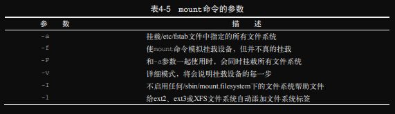
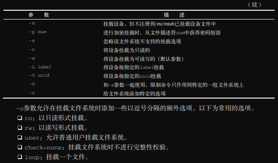

#### *2. `umount` 命令*

移除可移动设备时，不能直接将设备拔下，应该先卸载。

> **提示：** Linux不允许直接弹出已挂载的CD或DVD。如果从光驱中移除CD或DVD时遇到麻烦，那么最大的可能就是它还在虚拟目录中挂载着。应该先卸载，然后再尝试弹出。  
卸载设备的命令是 `umount`。该命令的格式非常简单。  

```bash
umount [directory | device]
```

`umount` 命令支持通过设备文件或者挂载点来指定要卸载的设备。如果有任何程序正在使用设备上的文件，则系统不允许卸载该设备。

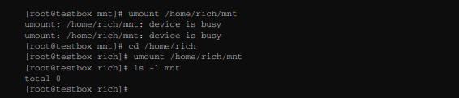

在本例中，因为命令行提示符仍然位于已挂载设备的文件系统中，所以 `umount` 命令无法卸载该镜像文件。一旦命令行提示符移出其镜像文件系统，`umount` 命令就能成功卸载镜像文件了。

### *3. 使用 `df` 命令*

`df` 命令可以方便的查看所有已挂载磁盘的使用情况。

```bash
lxc@Lxc:~/scripts/ch04-更多的bash shell命令$ df -t ext4 -t vfat
文件系统           1K-块     已用     可用 已用% 挂载点
/dev/nvme0n1p8 107014756 62707580 38824888   62% /
/dev/nvme0n1p1     98304    68636    29668   70% /boot/efi
```

`df` 命令会逐个显示已挂载的文件系统。与 `mount` 命令类似，`df` 命令会输出内核挂载的所有虚拟文件系统，因此可以使用 `-t` 选项来指定文件系统类型，进而过滤输出结果。该命令的输出如下。

- 设备文件位置
- 包含多少以1024字节为单位的块
- 使用了多少以1024字节为单位的块
- 还有多少以1024字节为单位的块可用
- 已用空间所占的百分比
- 设备挂载点

`df` 命令的大部分选项我们不会用到。常用选项之一是 `-h`，该选项会以人类易读（human-readable）的形式显示磁盘空间，通常用M来替代兆字节，用G来替代吉字节。`-T` 选项会打印文件系统类型。

```bash
lxc@Lxc:~$ df -hT
文件系统       类型      容量  已用  可用 已用% 挂载点
udev           devtmpfs  7.5G     0  7.5G    0% /dev
tmpfs          tmpfs     1.5G  2.2M  1.5G    1% /run
/dev/nvme0n1p8 ext4      103G   60G   38G   62% /
......
```

> **注意：** 记住，Linux系统后台一直有进程在处理文件。`df` 命令的输出值反映的是Linux系统认为的当前值。正在运行的进程有可能创建或删除了某个文件，但尚未释放该文件。这个值是不会被计算进空闲空间的。

### *3. 使用 `du` 命令*

`du` 命令可以显示某个特定目录（默认情况下是当前目录）的磁盘使用情况。这有助于你快速判断系统中是否存在磁盘占用大户。  
在默认情况下，`du` 命令会显示当前目录下所有的文件、目录和子目录的磁盘使用情况，并以磁盘块为单位来表明每个文件或目录占用了多大存储空间。  

```bash
lxc@Lxc:~$ du 
32	./.presage
......省略很长很长的输出
```

每行最左侧的数字是每个文件或目录所占用的磁盘块数。注意，这个列表是从目录层级的最底部开始，然后沿着其中包含的文件和子目录逐级向上的。  
下面这些选项可以使 `du` 命令的输出更易读。

- -c ： 显示所有已列出文件的总大小。
- -h ： 以人类易读的格式输出大小，分别用K表示千字节、M表示兆字节、G表示吉字节。
- -s ： 输出每个参数的汇总信息。

## 3. 处理数据文件

希望这些命令可以使我们的生活更轻松吧。

### *1. 数据排序*

在默认情况下，`sort` 命令会依据会话所指定的默认语言的排序规则来对文本文件中的数据进行排序。

```bash
lxc@Lxc:~/scripts/ch04-更多的bash shell命令$ cat file1 
one
two
three
four
five
lxc@Lxc:~/scripts/ch04-更多的bash shell命令$ sort file1
five
four
one
three
two
```

默认情况下，`sort` 命令会将数字视为字符并执行标准的字符排序。这种结果可能不是你想要的，可以使用 `-n` 选项来告诉 `sort` 将数字按值排序：

```bash
lxc@Lxc:~/scripts/ch04-更多的bash shell命令$ cat file2 
1
2
100
45
3
10
145
75
lxc@Lxc:~/scripts/ch04-更多的bash shell命令$ sort file2
1
10
100
145
2
3
45
75
lxc@Lxc:~/scripts/ch04-更多的bash shell命令$ sort -n file2
1
2
3
10
45
75
100
145
```

下表列出了 `sort` 命令的其他一些方便的选项。

|短选项|长选项|描述|
| :--: | :------------------------: | :-----------------------------------------------------: |
|-b|--ignore-leading-blanks|排序时忽略起始的空白字符|
|-C|--check=quiet|不排序，如果数据无序也不要报告|
|-c|--check|不排序，但检查输入数据是不是已排序；无序的话就报告|
|-d|--directionary-order|仅考虑空白字符和字母数字字符，不考虑特殊字符|
|-f|--ignore-case|大写字母默认先出现，该选项会忽略大小写|
|-g|--general-numeric-sort|按通用数值来排序（跟-n不同，把值当浮点数来排序，支持科学计数法表示的值|
|-i|--ignore-nonprinting|在排序时忽略不可打印字符|
|-k|--key=*POS1*[,*POS2*]|排序从POS1位置开始，到POS2位置结束（如果指定了POS2的话）|
|-M|--month-sort|用三字符月份名按月份排序|
|-m|--merge|将两个已排序数据文件合并|
|-n|--numeric-sort|按字符串数值来排序（并不转换为浮点数）|
|-o|--output=*file*|将排序的结果写到指定的文件中|
|-R|--random-sort 或 --random-source=*FILE*|根据随机哈希排序 或 指定-R选项用到的随机字节文件|
|-r|--reverse|逆序排序（升序变成降序）|
|-S|--buffer-size=*SIZE*|指定使用的内存大小|
|-s|--stable|禁止last-sort比较，实现稳定排序|
|-T|--temporary-directory=*DIR*|指定一个位置来存储临时工作文件|
|-t|--field-separator=*SEP*|指定字段分隔符|
|-u|--unique|和-c选项合用时，检查严格排序；不和-c选项合用时，相同的行仅输出一次（即去重相当于 sort \| uniq）|
|-z|--zero-terminated|在行尾使用NULL字符替代换行符|

例如，要根据用户ID对 /etc/passwd 按数值排序。

```bash
lxc@Lxc:~/scripts/ch04-更多的bash shell命令$ sort -t ':' -k 3 -n /etc/passwd
root:x:0:0:root:/root:/bin/bash
daemon:x:1:1:daemon:/usr/sbin:/usr/sbin/nologin
bin:x:2:2:bin:/bin:/usr/sbin/nologin
......
```

现在数据已经按第三个字段（用户的ID数值）排序妥当了。`-t` 选项指定冒号为字段分隔符，-k 选项指定第3个字段。  
`-n` 选项适合于排序数值型输出，比如 `du` 命令的输出。

```bash
lxc@Lxc:~/scripts/ch04-更多的bash shell命令$ du -sh * | sort -hr
140K	top.png
112K	bsd2.png
88K	GNU-1.png
84K	mount2.png
76K	ps2.png
56K	ps-l.png
52K	ps1.png
44K	ps-e.png
40K	mount1.png
28K	GNU-2.png
28K	bsd-s.png
24K	bsd1.png
20K	README.md
16K	umount.png
4.0K	file3
4.0K	file2
4.0K	file1
```

`-r` 选项降序排序，这样你就能轻易看出目录中哪些文件占用磁盘空间最多。

### *2. 数据搜索*

所谓的Linux三剑客之一：`grep`。另外两个在 [第19章](../ch19-初识sed和gawk/README.md)。  
`grep` 命令的格式如下：

```bash
grep [options] pattern [file]
```

`grep` 命令会在输入或指定文件中逐行搜索匹配指定模式的文本。该命令的输出是包含了匹配模式的行。

```bash
lxc@Lxc:~/scripts/ch04-更多的bash shell命令$ grep three file1
three
lxc@Lxc:~/scripts/ch04-更多的bash shell命令$ grep t file1
two
three
```

如果要进行反向搜索（即搜索不匹配指定模式的行），可以使用 `-v` 选项。

```bash
lxc@Lxc:~/scripts/ch04-更多的bash shell命令$ grep -v t file1
one
four
five
```

如果要显示匹配指定模式的行，可以使用 `-n` 选项。

```bash
lxc@Lxc:~/scripts/ch04-更多的bash shell命令$ grep -n t file1
2:two
3:three
```

如果只想知道有多少行含有匹配的模式，可以使用 `-c` 选项。

```bash
lxc@Lxc:~/scripts/ch04-更多的bash shell命令$ grep -c t file1
2
```

如果要指定多个匹配模式，可以使用 `-e` 选项来逐个指定。

```bash
lxc@Lxc:~/scripts/ch04-更多的bash shell命令$ grep -e t -e f file1
two
three
four
five
```

在默认情况下，`grep` 命令使用基本的Unix风格正则表达式（BRE）（参见 [第20章](../ch20-正则表达式/README.md)）来匹配模式。

```bash
lxc@Lxc:~/scripts/ch04-更多的bash shell命令$ grep [tf] file1
two
three
four
five
```

In addition, the variant programs egrep, fgrep and rgrep are  the  same  as  grep -E,  grep -F,  and  grep -r,
respectively.  These variants are deprecated, but are provided for backward compatibility.

- -E, --extended-regexp
Interpret PATTERNS as extended regular expressions (EREs, see below).
- -F, --fixed-strings
Interpret PATTERNS as fixed strings, not regular expressions.
- -r, --recursive
Read all files under each directory, recursively, following symbolic links only  if  they  are  on  the command  line.   Note  that  if no file operand is given, grep searches the working directory.  This is equivalent to the -d recurse option.
- -d ACTION, --directories=ACTION
If  an  input  file  is  a directory, use ACTION to process it.  By default, ACTION is read, i.e., read directories just as if they were ordinary files.  If ACTION is skip,  silently  skip  directories.   If ACTION  is  recurse, read all files under each directory, recursively, following symbolic links only if they are on the command line.  This is equivalent to the -r option.

### *3. 数据压缩*

下表列出了可用的Linux文件压缩工具。

|工具|文件扩展名|描述|
| :--------: | :-----: | :----------------------------------------------: |
|bzip2|.bz2|采用Burrows-Wheeler块排序文本压缩算法和霍夫曼编码|
|compress|.Z|最初的Unix文件压缩工具，已经快要无人使用了|
|gzip|.gz|GNU压缩工具，用Lempel-Zivwelch编码|
|xz|.xz|日渐流行的通用压缩工具|
|zip|.zip|Windows中PKZIP工具的Unix实现|

gzip是Linux中最流行的压缩工具。gzip软件包是GNU项目的产物，旨在编写一个能够替代原先Unix中compress工具的免费版本。这个软件包包括以下文件。

- gzip ： 用于压缩文件
- gzcat ： 用于查看压缩过的文本文件的内容（命令名是zcat）
- gunzip ： 用于解压文件

这些工具基本上和bzip2一样：

```bash
lxc@Lxc:~/scripts/ch04-更多的bash shell命令$ gzip file1 
lxc@Lxc:~/scripts/ch04-更多的bash shell命令$ ls -l file1.gz 
-rw-rw-r-- 1 lxc lxc 50 12月  1 15:28 file1.gz
lxc@Lxc:~/scripts/ch04-更多的bash shell命令$ zcat file1.gz 
one
two
three
four
five
```

gzip会压缩命令行中指定的文件。也可以指定多个文件名或是用通配符来一次性压缩多个文件。

```bash
lxc@Lxc:~/scripts/ch04-更多的bash shell命令$ gzip file*
lxc@Lxc:~/scripts/ch04-更多的bash shell命令$ ls file*
file2.gz  file3.gz
lxc@Lxc:~/scripts/ch04-更多的bash shell命令$ gunzip file*
lxc@Lxc:~/scripts/ch04-更多的bash shell命令$ ls file*
file2  file3
```

### *4. 数据归档*

目前，Unix和Linux中最流行的归档工具是 `tar` 命令。`tar` 命令最开始是用来将文件写到磁带设备上归档的，但它也可以将输出写入文件，这种用法成了在Linux中归档数据的普遍用法。  
`tar` 命令的格式如下：

```bash
tar function [options] object1 object2 ....
```

*function* 参数定义了 `tar` 命令要执行的操作，如下表所示。

|操作|长选项|描述|
| :--: | :---------------: | :-------------------------------------------: |
|-A|--concatenate|将一个tar归档文件追加到另一个tar归档文件的末尾|
|-c|--create|创建新的tar归档文件|
|-d|--diff 或 --delete|检查归档文件与文件系统的不同之处 或 从tar归档文件中删除文件|
|-r|--append|追加文件到已有tar归档文件末尾|
|-t|--list|列出已有tar归档文件的内容|
|-u|--update|将比tar归档文件中已有的同名文件更新的文件追加到该归档文件|
|-x|--extract|从tar归档文件中提取文件|

每种操作都使用 *option* （选项）来定义对tar归档文件的具体行为，下表列出了常用的选项。

|选项|描述|
| :--------: | :---------------------------------: |
|-C *dir*|切换到指定目录|
|-f *file*|将结果输出到文件（或设备）|
|-j|将输出传给bzip2命令进行压缩|
|-J|将输出传给xz命令进行压缩|
|-p|保留文件的所有权限|
|-v|在处理文件时显示文件名|
|-z|将输出传给gzip命令进行压缩|
|-Z|将输出传给compress命令进行压缩|

这些选项经常合并使用。  
可以使用下面的命令创建归档文件。

```bash
lxc@Lxc:~/scripts/ch04-更多的bash shell命令$ tar -cvf file.tar file*
file1
file2
file3
lxc@Lxc:~/scripts/ch04-更多的bash shell命令$ ls file*
file1  file2  file3  file.tar
```

归档并压缩（使用gzip）。

```bash
lxc@Lxc:~/scripts/ch04-更多的bash shell命令$ tar -cvzf file.tgz file1 file2
file1
file2
```

下面的命令列出（但不提取）归档文件的内容。

```bash
lxc@Lxc:~/scripts/ch04-更多的bash shell命令$ tar -tf file.tar
file1
file2
file3
lxc@Lxc:~/scripts/ch04-更多的bash shell命令$ tar -tf file.tgz
file1
file2
```

下面的命令从归档文件中提取内容。

```bash
lxc@Lxc:~/scripts/ch04-更多的bash shell命令$ tar -xvf file.tar 
file1
file2
file3
```

下面的命令解压缩并提取已压缩的归档文件的内容。

```bash
lxc@Lxc:~/scripts/ch04-更多的bash shell命令$ tar -xzvf file.tgz 
file1
file2
```

常见的就是这几个了。希望能够使你的生活更轻松。

> **提示：** 在下载开源软件时经常会看到文件名以 .tgz 或 .tar.gz 结尾，这是经gzip压缩过的tar文件。提取这类文件的方法见上面。