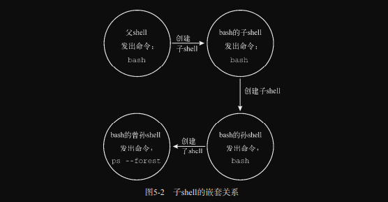

# ch05 理解shell

本章会带你全面学习shell进程及其在各种情况下的运作方式。我们将探究如何创建子shell及其与父shell之间的关系，了解各种会创建子进程和不会创建子进程的命令。另外，本章还会涉及一些提高命令行效率的shell窍门和技巧。

## 1. shell的类型

当你登录系统时，系统启动什么样的shell取决于你的个人用户配置。在 /etc/passwd 文件的第7个字段列出了该用户的默认shell程序。只要用户登录某个虚拟控制台终端或是在GUI中启动终端仿真器，默认的shell程序就会启动。

```bash
lxc@Lxc:~/scripts/ch05$ cat /etc/passwd
lxc:x:1000:1000:Lxc,,,:/home/lxc:/bin/bash
......
```

在现代Linux系统中，bash shell程序通常位于 /usr/bin 目录。不过，在你的Linux系统中，也有可能位于 /bin 目录。`which bash` 命令可以帮助我们找出bash shell的位置：

```bash
lxc@Lxc:~/scripts/ch05$ which bash
/usr/bin/bash
lxc@Lxc:~/scripts/ch05$ ls -lF /usr/bin/bash
-rwxr-xr-x 1 root root 1183448 4月  18  2022 /usr/bin/bash*
```

`ls` 命令的长列表尾部的 `*` 表明bash文件是一个可执行程序。

> **注意：** 在现代Linux系统中，/bin 目录通常是 /usr/bin 目录的符号链接，/sbin目录通常是/usr/sbin目录的符号链接。这就是为什么用户lxc用户的默认shell程序是/bin/bash，但bash shell程序实际位于/usr/bin目录。

在大多数Linux系统中，/etc/shells 文件列出了各种已安装的shell，这些shell可以作为用户的默认shell。

```bash
lxc@Lxc:~/scripts/ch05$ cat /etc/shells
# /etc/shells: valid login shells
/bin/sh
/bin/bash
/usr/bin/bash
/bin/rbash
/usr/bin/rbash
/bin/dash
/usr/bin/dash
/bin/zsh
/usr/bin/zsh
```

**默认的交互式shell（default interactive shell）** 也称 **登录shell（login shell）**，只要用户登录某个虚拟控制台终端或是在GUI中启动终端仿真器，该shell就会启动。  
作为 **默认的系统shell（default system shell）**，sh(/bin/bash)用于那些需要在启动时使用的系统shell脚本。

你经常会看到一些发行版使用软连接将默认的系统shell指向bash shell，比如CentOS发行版：

```bash
lxc@Lxc:~/scripts/ch05$ ls -lF `which sh`
lrwxrwxrwx 1 root root 13 11月  9 21:35 /usr/bin/sh -> /usr/bin/bash*
```

但要注意，在有些发行版。默认的系统shell并不指向bash shell，比如Ubuntu发行版：

```bash
lxc@Lxc:~/scripts/ch05$ ls -lF `which sh`
lrwxrwxrwx 1 root root 13 11月  9 21:35 /usr/bin/sh -> /usr/bin/dash*
# 本书使用的是Ubuntu发行版，不过更改了这个软连接使其指向了bash shell。
```

并不是非得使用默认的交互式shell，可以启动任意一种已安装的shell，只需输入其名称即可。但屏幕上不会有任何提示或消息表明你当前使用的是哪种shell。`$0` 变量可以助你一臂之力。命令 `echo $0` 会显示当前shell的名称，提供必要的参考。

> **注意：** 使用 `echo $0` 显示当前所用shell的做法仅限在shell命令行中使用。如果在shell脚本中使用，则显示的是该脚本的名称。可以参见[第14章](../ch14/README.md)。

```bash
lxc@Lxc:~/scripts/ch05$ echo $0
-bash
lxc@Lxc:~/scripts/ch05$ dash
$ echo $0
dash
```

> **注意：** 在上面的例子中，注意第一个命令的输出：bash之前有一个连字符(-)。这表明该shell是用户的登录shell。

`$` 是dash shell的CLI提示符。输入命令 `exit` 就可以退出dash shell程序（对于bash shell也是如此）：

```bash
$ exit
lxc@Lxc:~/scripts/ch05$ echo $0
-bash
```

## 2. shell的父子关系

用户登录某个虚拟控制台终端或在GUI中运行终端仿真器时所启动的默认的交互式shell（登录shell）是一个 **父shell**。到目前为止，都是由父shell提供CLI提示符并等待命令输入。  
当你在CLI提示符处输入 `bash` 命令（或是其他shell程序名）时，会创建新的shell程序。这是一个 **子shell**。子shell也拥有CLI提示符，同样会等待命令输入。

```bash
lxc@Lxc:~/scripts/ch05$ ps -f
UID          PID    PPID  C STIME TTY          TIME CMD
lxc         3313    3308  0 10:28 pts/0    00:00:00 bash
lxc        10040    3313  0 11:31 pts/0    00:00:00 ps -f
lxc@Lxc:~/scripts/ch05$ bash
lxc@Lxc:~/scripts/ch05$ ps -f
UID          PID    PPID  C STIME TTY          TIME CMD
lxc         3313    3308  0 10:28 pts/0    00:00:00 bash
lxc        10041    3313  2 11:31 pts/0    00:00:00 bash
lxc        10225   10041  0 11:31 pts/0    00:00:00 ps -f
```

> **注意：** 进程就是正在运行的程序。bash shell是一个程序，当它运行的时候，就成了进程。一个 运行中的shell同样是进程。因此，在说到运行bash shell的时候，你会经常看到 "shell" 和 "进程" 这两个词交换使用。

输入命令 `bash` 之后，就创建了一个子shell（可以通过PPID来确认父子关系）。你可以从显示结果中看到有两个bash shell程序在运行。在生成子shell进程时，只有部分父进程的环境被复制到了子shell环境中。下图展示了这种关系。


子shell既可以从父shell中创建，也可以从另一个子shell中创建：

```bash
lxc@Lxc:~/scripts/ch05$ ps -f
UID          PID    PPID  C STIME TTY          TIME CMD
lxc         3313    3308  0 10:28 pts/0    00:00:00 bash
lxc        10993    3313  0 11:39 pts/0    00:00:00 ps -f
lxc@Lxc:~/scripts/ch05$ bash
lxc@Lxc:~/scripts/ch05$ bash
lxc@Lxc:~/scripts/ch05$ bash
lxc@Lxc:~/scripts/ch05$ ps --forest
    PID TTY          TIME CMD
   3313 pts/0    00:00:00 bash
  10994 pts/0    00:00:00  \_ bash
  11177 pts/0    00:00:00      \_ bash
  11360 pts/0    00:00:00          \_ bash
  11543 pts/0    00:00:00              \_ ps
```

下图展示了这种关系：



可以使用 `exit` 命令有条不紊的退出子shell。

```bash
lxc@Lxc:~/scripts/ch05$ ps -f
UID          PID    PPID  C STIME TTY          TIME CMD
lxc         3313    3308  0 10:28 pts/0    00:00:00 bash
lxc        10994    3313  0 11:39 pts/0    00:00:00 bash
lxc        11177   10994  0 11:39 pts/0    00:00:00 bash
lxc        11360   11177  0 11:39 pts/0    00:00:00 bash
lxc        11766   11360  0 11:42 pts/0    00:00:00 ps -f
lxc@Lxc:~/scripts/ch05$ exit
exit
lxc@Lxc:~/scripts/ch05$ ps --forest
    PID TTY          TIME CMD
   3313 pts/0    00:00:00 bash
  10994 pts/0    00:00:00  \_ bash
  11177 pts/0    00:00:00      \_ bash
  11768 pts/0    00:00:00          \_ ps
lxc@Lxc:~/scripts/ch05$ exit
exit
lxc@Lxc:~/scripts/ch05$ exit
exit
lxc@Lxc:~/scripts/ch05$ ps --forest
    PID TTY          TIME CMD
   3313 pts/0    00:00:00 bash
  11770 pts/0    00:00:00  \_ ps
```

bash shell程序可以使用命令行选项来修改shell的启动方式。下表列出了bash命令的部分可用选项。

|选项|描述|
| :----------: | :---------------------------------------: |
|-c *string*|从 *string* 中读取命令并进行处理|
|-i|启动一个能够接收用户输入的交互式shell|
|-r|启动一个受限shell，将用户限制在默认目录中|
|-s|从标准输入中读取命令|

可以输入 `man bash` 获取关于 `bash` 命令的更多帮助信息，了解更多的命令行选项。`bash --help` 命令也会提供一些额外的帮助。

### *1. 查看进程列表*

可以在单行中指定要一次运行的一系列命令。这可以通过命令列表来实现，只需将命令之间以分号分隔即可：

```bash
lxc@Lxc:~/scripts/ch05$ pwd; ls *.png; cd /etc; pwd; cd; pwd
/home/lxc/scripts/ch05
parchildshell2.png  parchishell.png
/etc
/home/lxc
```

可以将命令列表放入圆括号内形成 **进程列表**。

```bash
lxc@Lxc:~/scripts/ch05$ (pwd; ls *.png; cd /etc; pwd; cd; pwd)
/home/lxc/scripts/ch05
parchildshell2.png  parchishell.png
/etc
/home/lxc
```

圆括号的加入使命令列表变成了进程列表，进程列表会生成一个子shell来执行这些命令。

> **注意：** 进程列表是 **命令分组（command grouping）** 的一种。另一种命令分组是将命令放入花括号内，并在命令尾部以分号作结。语法为 `{ command; }`。使用花括号进行命令分组并不会像进程列表那样创建子shell。

要想知道是否生成了子shell，需要使用一个命令输出环境变量的值。这个命令就是 `echo $BASH_SUBSHELL`。如果命令返回0，那么表明没有子shell。如果命令返回1或者更大的数字，则表明存在子shell。

```bash
lxc@Lxc:~/scripts/ch05$ pwd; ls *.png; cd /etc; pwd; cd; pwd; echo $BASH_SUBSHELL
/home/lxc/scripts/ch05
parchildshell2.png  parchishell.png
/etc
/home/lxc
0
lxc@Lxc:~$
```

在输出结果的最后是数字0，这表明并未创建子shell来执行这些命令。  
如果改用进程列表，则结果就不一样了。

```bash
lxc@Lxc:~/scripts/ch05$ (pwd; ls *.png; cd /etc; pwd; cd; pwd; echo $BASH_SUBSHELL)
/home/lxc/scripts/ch05
parchildshell2.png  parchishell.png
/etc
/home/lxc
1
lxc@Lxc:~/scripts/ch05$ 
```

这次输出结果的最后数字是1。这表明的确创建了子shell来执行这些命令。此外，还有一点你可以发现，使用命令列表时不使用子shell执行命令，在执行完命令列表时，当前的目录成了 `lxc@Lxc:~$`。而使用进程列表，会创建子shell来执行这些命令，命令执行完毕后的目录保持不变 `lxc@Lxc:~/scripts/ch05$ `。  
因此，**进程列表就是使用圆括号包围起来的一组命令，它能够创建子shell来执行这些命令。**  
你还可以在进程列表中嵌套圆括号来创建子shell的子shell：

```bash
lxc@Lxc:~/scripts/ch05$ (pwd; echo $BASH_SUBSHELL)
/home/lxc/scripts/ch05
1
lxc@Lxc:~/scripts/ch05$ (pwd; (echo $BASH_SUBSHELL))
/home/lxc/scripts/ch05
2
```

在第一个进程列表中，数字1表明有一个子shell，这个结果符合预期。在第二个进程列表中，其中嵌套了一个进程列表，这个嵌套的进程列表在子shell进程中产生了另一个子shell来执行该命令。因此数字2表示的就是这个子shell。  
子shell在shell脚本中经常用于多进程处理。但是，创建子shell的成本不菲，会明显拖慢任务进度。在交互式CLI会话中，子shell存在同样的问题，它并非真正的多进程处理，原因在于终端与子shell的I/O绑定在了一起。

### 2. 别出心裁的子shell用法

进程列表、协程和管道都用到了子sehll，各自都可以有效运用于交互式shell。  
在交互式shell中，一种高效的子shell用法是后台模式。在讨论如何配合使用后台模式和子shell之前，需要先搞明白什么是后台模式。

#### *1. 探究后台模式*

在后台模式中运行命令可以在处理命令的同时让出CLI，以供他用。要想将命令置于后台模式，可以在命令末尾加上字符 `&`。

*来个例子：*

```bash
lxc@Lxc:~/scripts/ch05$ sleep 30&
[1] 7828
lxc@Lxc:~/scripts/ch05$ ps -f
UID          PID    PPID  C STIME TTY          TIME CMD
lxc         6137    6132  0 14:01 pts/0    00:00:00 bash
lxc         7828    6137  0 14:12 pts/0    00:00:00 sleep 30
lxc         7829    6137  0 14:12 pts/0    00:00:00 ps -f
```

`sleep` 命令会在后台（&）睡眠30秒。当被置于后台时，在shell CLI提示符返回之前，屏幕上会出现两条信息。第一条信息是方括号中的后台作业号（1）。第二条信息是后台进程ID（7828）。  
除了 `ps` 命令，也可以使用 `jobs` 命令来显示后台作业信息。`jobs` 命令能够显示当前运行在后台模式中属于你的所有进程（作业）：

```bash
lxc@Lxc:~/scripts/ch05$ jobs
[1]+  已完成               sleep 30
```

`jobs` 命令会在方括号中显示作业号（1）。除此之外，还有作业的当前状态（已完成）以及对应的命令（sleep 30）。  

利用 `jobs` 命令的 `-l` 选项，还可以看到更多的相关信息。除了默认信息，`-l` 选项还会显示命令的PID。

```bash
lxc@Lxc:~/scripts/ch05$ sleep 1&
[1] 8190
lxc@Lxc:~/scripts/ch05$ jobs -l
[1]+  8190 已完成               sleep 1
```

> **提示：** 如果运行多个后台进程，则还有一些额外信息可以显示哪个后台作业是最近启动的。在 `jobs` 命令的显示中，最近启动的作业是在其作业号之后会有一个加号（+），在它之前启动的进程（the second newest process）则以减号（-）表示。这两个符号还被用于表示默认作业，参见[第16章](../ch16/README.md#1-查看作业) 的注意部分。

#### *2. 将进程列表置于后台*

通过将进程列表置入后台，可以在子shell中进行大量的多进程处理。由此带来的一个好处是终端不再和子shell的I/O绑定在一起。  
之前说过，进程列表是在子shell中运行的一系列命令。

```bash
lxc@Lxc:~/scripts/ch05$ (sleep 2; echo $BASH_SUBSHELL; sleep 2)
1
```

在上面的例子中，执行命令后，2秒后，显示数字1，再过2秒后，返回命令行提示符。这符合我们的预期。

```bash
lxc@Lxc:~/scripts/ch05$ (sleep 2; echo $BASH_SUBSHELL; sleep 2)&
[1] 8704
lxc@Lxc:~/scripts/ch05$ 1

[1]+  已完成               ( sleep 2; echo $BASH_SUBSHELL; sleep 2 )
```

在这个例子中，执行命令后，立刻返回作业号（1）和进程ID（8704），返回命令行提示符。两秒后，数字1出现在提示符右侧。再次按下Enter键，就会得到另一个提示符了（如果自显示数字1之后，再过2秒，按下Enter键，就会显示后台作业的结束状态）。如下：

```bash
lxc@Lxc:~/scripts/ch05$ (sleep 2; echo $BASH_SUBSHELL; sleep 2)&
[1] 9013
lxc@Lxc:~/scripts/ch05$ # 这里是按下了Enter键
lxc@Lxc:~/scripts/ch05$ # 这里是按下了Enter键
lxc@Lxc:~/scripts/ch05$ # 这里是按下了Enter键
lxc@Lxc:~/scripts/ch05$ 1

lxc@Lxc:~/scripts/ch05$ # 这里是按下了Enter键
[1]+  已完成               ( sleep 2; echo $BASH_SUBSHELL; sleep 2 )
```

当然，这里的只是示例而已，你可以使用后台进程列表执行你想完成的任务。

```bash
lxc@Lxc:~/tt$ (tar -czf Doc.tar.gz text1.txt text2.txt ; tar -czf Doc2.tgz text2.txt text3.txt )&
[1] 9143
lxc@Lxc:~/tt$ ls
Doc2.tgz  Doc.tar.gz  text1.txt  text2.txt  text3.txt
[1]+  已完成               ( tar -czf Doc.tar.gz text1.txt text2.txt; tar -czf Doc2.tgz text2.txt text3.txt )
# 注意，后台作业的结束状态会在下一个显示提示符的命令执行后打印出。
# 你如果想单独看后台作业的结束状态，单纯的按一下Enter键也行。
```

将进程列表置入后台并不是子shell在CLI中仅有的创造性方法，还有一种方法是协程。

#### *3. 协程*

协程同时做两件事：一是在后台生成一个子shell；二是在该子shell中执行命令。  
要进行协程处理，可以结合 `coproc` 命令以及要在子shell中执行的命令。

```bash
lxc@Lxc:~/scripts/ch05$ coproc sleep 10
[1] 9544
lxc@Lxc:~/scripts/ch05$ jobs
[1]+  运行中               coproc COPROC sleep 10 &
```

除了会创建子shell，协程基本上就是将命令置入后台。当输入 `coproc` 命令及其参数之后，你会发现后台启用了一个作业。屏幕上会显示该后台作业号（1）以及进程ID（2689）。  
从上面的例子中可以看到，在子shell中执行的后台命令 `coproc COPROC sleep 10 &`。COPROC是 `coproc` 命令给进程起的名字。可以使用命令的扩展语法来自己设置这个命令：

```bash
lxc@Lxc:~/scripts/ch05$ coproc My_Job { sleep 10; }
[1] 9864
lxc@Lxc:~/scripts/ch05$ jobs
[1]+  运行中               coproc My_Job { sleep 10; } &
```

使用扩展语法，协程名被设置成了 My_Job。这里要注意，扩展语法写起来有点小麻烦。你必须确保在左花括号和内部命令名之间有一个空格，内部命令必须以分号结尾，分号和右花括号之间也得有一个空格。  

> **注意：** 协程能够让你尽情的发挥想象力，发送或接收来自子shell中进程的信息。只有在拥有多个协程时才需要对协程进行命名，因为你要和它们进程通信。否则的话，让 *coproc* 命令将其设置成默认名称 COPROC 即可。

你可以将协程和进程列表结合起来创建嵌套子shell。只需将命令 `coproc` 放在进程列表之前即可：

```bash
lxc@Lxc:~/scripts/ch05$ coproc ( sleep 10; sleep 2 )
[1] 10293
lxc@Lxc:~/scripts/ch05$ jobs
[1]+  运行中               coproc COPROC ( sleep 10; sleep 2 ) &
lxc@Lxc:~/scripts/ch05$ ps --forest
    PID TTY          TIME CMD
   6975 pts/2    00:00:00 bash
  10293 pts/2    00:00:00  \_ bash
  10294 pts/2    00:00:00  |   \_ sleep
  10345 pts/2    00:00:00  \_ ps
```

记住，生成子shell的成本可不低，而且速度很慢。创建嵌套子shell更是火上浇油。  
子shell提供了灵活性和便利性。要想获得这些优势，重要的是要理解子shell的行为方式。对于命令也是如此。下一节将研究内建命令与外部命令之间的行为差异。

## 3. 理解外部命令和内建命令

搞明白shell的内建命令和外部命令非常重要。两者的操作方式大不相同。

### *1. 外部命令*

**外部命令（有时也称为文件系统命令）** 是存在于bash shell之外的程序。也就是说，它并不属于shell程序的一部分。外部命令程序通常位于 /bin、/usr/bin、/sbin、/usr/sbin目录中。

`ps` 命令就是一个外部命令。可以使用 `which` 或 `type` 命令来找到对应的文件名：

```bash
lxc@Lxc:~/scripts/ch05$ which ps
/usr/bin/ps
lxc@Lxc:~/scripts/ch05$ type ps
ps 已被录入哈希表 (/usr/bin/ps)
lxc@Lxc:~/scripts/ch05$ ls -l /usr/bin/ps
-rwxr-xr-x 1 root root 137688 10月 31 19:35 /usr/bin/ps
```

每当执行外部命令时，就会创建一个子进程。这种操作称为 **衍生（forking）**。外部命令 `ps` 会显示其父进程以及自己所对应的衍生子进程。

```bash
lxc@Lxc:~/scripts/ch05$ ps -f
UID          PID    PPID  C STIME TTY          TIME CMD
lxc         6137    6132  0 14:01 pts/0    00:00:00 bash
lxc        10941    6137  0 15:24 pts/0    00:00:00 ps -f
lxc@Lxc:~/scripts/ch05$ echo $$
6137
```

作为外部命令，`ps` 命令在执行时会产生一个子进程。在这里，`ps` 命令的PID是 10941，PPID是6137。下图展示了外部命令执行时的衍生过程。


只要涉及进程衍生，就需要耗费时间和资源来设置子进程的环境。因此，外部命令系统开销较高。

> 无论是衍生出子进程还是创建了子进程，都仍然可以通过信号与其互通，这一点无论是在命令行还是在编写脚本时都及其有用。进程间以发送信号的方式彼此通信。[第16章](../ch16/README.md) 将介绍信号和信号发送。

在使用内建命令时，不需要衍生子进程。因此，内建命令的系统开销较低。

### 2. 内建命令

与外部命令不同，**内建命令无须使用子进程来执行。内建命令已经和shell编译成一体，作为shell的组成部分存在，无须借助外部程序文件来执行。**

`cd` 命令和 `exit` 命令都内建于bash shell。可以使用 `type` 命令来判断某个命令是否为内建：

```bash
lxc@Lxc:~/scripts/ch05$ type cd
cd 是 shell 内建
lxc@Lxc:~/scripts/ch05$ type exit
exit 是 shell 内建
lxc@Lxc:~/scripts/ch05$ type type
type 是 shell 内建
```

因为内建命令既不需要衍生出子进程来执行，也不用打开程序文件，所以执行速度更快，效率也更高。  
注意，有些命令有多种实现。例如，`echo` 和 `pwd` 既有内建命令也有外部命令。两种实现有差异。要查看命令的不同实现，可以使用 `type` 的 `-a` 选项：

```bash
lxc@Lxc:~/scripts/ch05$ type -a echo
echo 是 shell 内建
echo 是 /usr/bin/echo
echo 是 /bin/echo
lxc@Lxc:~/scripts/ch05$ which echo
/usr/bin/echo
lxc@Lxc:~/scripts/ch05$ type -a pwd
pwd 是 shell 内建
pwd 是 /usr/bin/pwd
pwd 是 /bin/pwd
lxc@Lxc:~/scripts/ch05$ which pwd
/usr/bin/pwd
```

`type -a` 显示每个命令的两种实现（内建和外部）。`which` 命令只显示外部命令文件。

> **提示：** 对于有多种实现的命令，如果想使用其外部命令实现，直接指明对应的文件即可。例如，要使用外部命令 `pwd`，可以输入 `/usr/bin/pwd`。

#### *1. 使用 `history` 命令*

bash shell会跟踪你最近使用过的命令。你可以重新唤回这些命令，加以重用。`history` 是一个实用的内建命令，能帮助你管理先前执行过的命令。  
要查看最近用过的命令，可以使用不带任何选项的 `history` 命令：

```bash
lxc@Lxc:~/scripts/ch05$ history
    1  cd tt/
    2  ls
    3  cd ..
    ......省略了很长的输出
```

> **提示：** 你可以修改保存在bash历史记录中的命令数量。为此，需要修改名为 `HISTSIZE` 的环境变量（参见 [第6章](../ch06/README.md#4-默认的shell环境变量)）。

你可以唤回并重用历史记录列表中最近的那条命令。输入 `!!`，然后按Enter键即可。

```bash
lxc@Lxc:~/scripts/ch05$ ps --forest
    PID TTY          TIME CMD
  12552 pts/2    00:00:00 bash
  14143 pts/2    00:00:00  \_ ps
lxc@Lxc:~/scripts/ch05$ !!
ps --forest
    PID TTY          TIME CMD
  12552 pts/2    00:00:00 bash
  14155 pts/2    00:00:00  \_ ps
```

当输入 `!!` 时，bash会先显示从shell的历史记录中唤回的命令，然后再执行该命令。  
历史记录中的命令被保存在 `~/.bash_history` 文件中。  
这里要注意的是，在CLI会话期间，bash命令的历史记录被保存在内存之中。当shell退出时才被写入历史文件中，这个问题在 [第6章](../ch06/README.md#4-默认的shell环境变量) 已有论述。  

可以在不退出shell的情况下强制将命令历史记录写入.bash_history文件。为此，需要使用 `history` 命令的 `-a` 选项：

```bash
lxc@Lxc:~/scripts/ch05$ history -a
lxc@Lxc:~/scripts/ch05$ history | tail
  569  (tar -czf Doc.tar.gz text1.txt text2.txt ; tar -czf Doc2.tgz text2.txt text3.txt )&
  570  ls
  571  ls Doc.tar.gz 
  572  cd 
  573  cd scripts/ch05/
  574  ps -f
  575  echo $$
  576  man history
  577  history -a
  578  history | tail
lxc@Lxc:~/scripts/ch05$ cat ~/.bash_history | tail
ls
(tar -czf Doc.tar.gz text1.txt text2.txt ; tar -czf Doc2.tgz text2.txt text3.txt )&
ls
ls Doc.tar.gz 
cd 
cd scripts/ch05/
ps -f
echo $$
man history
history -a
```

注意，`history` 命令的输出与 ~/.bash_history 文件内容是一样的。除了最后的那条 `history | tail` 命令。

> **注意：** 如果打开了多个终端会话，则仍然可以使用 `history -a` 命令在每个打开的会话中向 .bash_history 文件添加记录。但是历史记录并不会在其他打开的终端会话中自动更新。这是因为.bash_history 文件只在首次启动终端会话的时候才会被读取。要想强制重新读取 .bash_history 文件，更新内存中的终端会话历史记录，可以使用 `history -n` 命令。

你可以唤回历史记录中的任意命令。只需输入惊叹号和命令在历史记录中的编号即可：

```bash
lxc@Lxc:~/scripts/ch05$ history | tail
  572  cd 
  573  cd scripts/ch05/
  574  ps -f
  575  echo $$
  576  man history
  577  history -a
  578  history | tail
  579  cat ~/.bash_history | tail
  580  man history
  581  history | tail
lxc@Lxc:~/scripts/ch05$ !574
ps -f
UID          PID    PPID  C STIME TTY          TIME CMD
lxc         6137    6132  0 14:01 pts/0    00:00:00 bash
lxc        15119    6137  0 16:37 pts/0    00:00:00 ps -f
```

和执行最近的命令一样，bash shell会先显示从历史记录中唤回的命令，然后再执行该命令。  

> **提示：** 如果要清除历史记录，很简单，输入 `history -c` 即可。接下来再输入 `history -a`，清除.bash_history文件。

内建命令 `history` 能做到的事情远不止这些。可以通过 `man history` 来查看 `history` 的手册页。

#### *2. 使用命令别名*

`alias` 命令是另一个实用的内建命令。命令别名允许为常用命令及其参数创建另一个名称。  
你所使用的Linux发行版很有可能已经为你设置好了一些常用命令的别名。使用 `alias` 命令以及选项 `-p` 可以查看当前可用的别名：

```bash
lxc@Lxc:~/scripts/ch05$ alias -p
alias l='ls -CF'
alias la='ls -A'
alias ll='ls -alF'
alias ls='ls --color=auto'
......
```

注意在该Ubuntu Linux发行版中，有一个别名取代了标准命令 `ls`。该别名中加入了 `--color=auto` 选项，以便在终端支持彩色的情况下，`ls` 命令可以使用色彩编码（比如，使用蓝色表示目录）。`LS_COLORS` 环境变量控制着所用的彩色编码。

> **提示：** 如果经常跳转于不同的发行版，那么在使用色彩编码来分辨某个名称究竟是目录还是文件时，一定要小心。因为色彩编码并未实现标准化。所以最好用 `ls -F` 来判断文件类型。

可以使用 `alias` 命令创建自己的别名：

```bash
lxc@Lxc:~/scripts/ch05$ alias li='ls -i'
lxc@Lxc:~/scripts/ch05$ li
2123732 extern.png  2123049 parchildshell2.png  2125585 parchishell.png  2121945 README.md
lxc@Lxc:~/scripts/ch05$ bash
lxc@Lxc:~/scripts/ch05$ li
li：未找到命令
lxc@Lxc:~/scripts/ch05$ exit
lxc@Lxc:~/scripts/ch05$ li
2123732 extern.png  2123049 parchildshell2.png  2125585 parchishell.png  2121945 README.md
```

定义好别名之后，就可以随时在shell或者shell脚本中使用了。要注意，因为命令别名属于内建命令，所以别名仅在其被定义的shell进程中才有效。  
可以使用 unlias *alias_name* 来删除命令别名。
如果想持久化别名的效果，可以通过修改环境文件来实现。可以参考[第6章](../ch06/README.md#4-环境变量持久化)。 