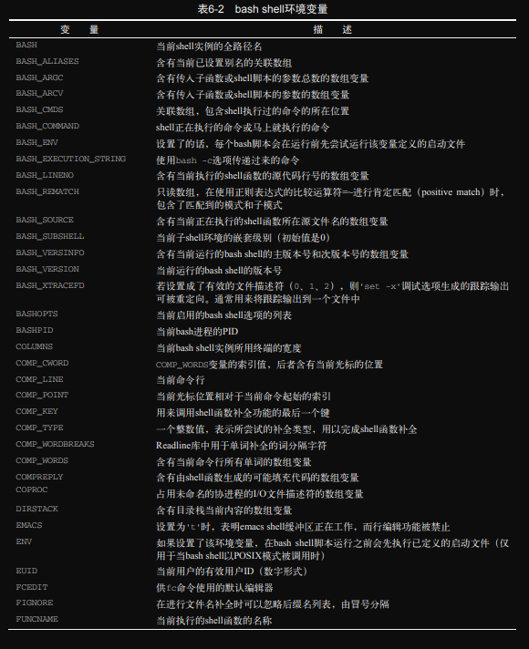
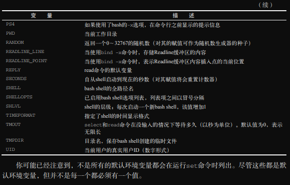

# ch06 Linux环境变量

很多程序和脚本通过环境变量来获取系统信息、存储临时信息和配置信息。在Linux系统中，有很多地方可以设置环境变量，了解去哪里设置相应的环境变量很重要。  
本章先带你逐步了解Linux环境变量：它们存储在哪里、如何使用，以及如何创建自己的环境变量，最后以数组变量的用法作结。

## 1. 什么是环境变量

bash shell使用 **环境变量** 来存储shell会话和工作环境的相关信息（这也是被称作环境变量的原因）。环境变量允许在内存中存储数据，以便shell中运行的程序或脚本能够轻松访问到这些数据。这也是存储持久数据的一种简便方法。  
bash shell中有两种环境变量。  

- 全局变量
- 局部变量

> **注意：** 尽管bash shell使用的专有环境变量是一致的，但不同的Linux发行版经常会添加自己的环境变量，可以查看你的Linux发行版文档。

### *1. 全局环境变量*

全局环境变量对于shell会话和所有生成的子shell都是可见的。局部环境变量则只对创建它的shell可见。如果程序创建的子shell需要获取父shell的信息，那么全局环境变量就能派上用场。  
Linux系统在你启动bash会话时就设置好了一些全局环境变量（[6.6节](./README.md#6-定位系统环境变量)将展示具体都有哪些变量）。系统环境变量基本上会使用大写字母，以区别用户自定义的环境变量。  
可以使用 `env` 命令或 `printenv` 命令来查看全局变量：

```bash
lxc@Lxc:~/scripts/ch06$ env
SHELL=/bin/bash
......
```

Linux系统为bash shell设置的全局环境变量数目众多，上面省略了输出。其中很多是在登录的过程中设置的，另外，你的登录方式也会影响所设置的环境变量。  
要显示个别环境变量可以使用 `printenv` 命令，不能使用 `env` 命令。也可以使用 `echo` 命令。

```bash
lxc@Lxc:~/scripts/ch06$ printenv HOME
/home/lxc
lxc@Lxc:~/scripts/ch06$ echo $HOME
/home/lxc
lxc@Lxc:~/scripts/ch06$ env HOME
env: “HOME”: 没有那个文件或目录
```

在变量名前加上 `$` 可不仅仅是能够显示变量的当前值，它还能让变量作为其它命令的参数：

```bash
lxc@Lxc:~/scripts/ch06$ ls $HOME
公共的  模板  视频  图片  文档  下载  音乐  桌面 .......
```

如前所述，全局环境变量可用于进程的子shell。

```bash
lxc@Lxc:~/scripts/ch06$ bash
lxc@Lxc:~/scripts/ch06$ ps -f
UID          PID    PPID  C STIME TTY          TIME CMD
lxc         5670    3319  0 14:51 pts/3    00:00:00 bash
lxc         6039    5670  0 14:51 pts/3    00:00:00 bash
lxc         6225    6039  0 14:52 pts/3    00:00:00 ps -f
lxc@Lxc:~/scripts/ch06$ echo $HOME
/home/lxc
lxc@Lxc:~/scripts/ch06$ exit
exit
```

在这个例子中，用 `bash` 命令生成一个子shell后，显示了HOME环境变量的当前值。这个值和父shell中的值一模一样。

### *2. 局部环境变量*

顾名思义，**局部环境变量** 只能在定义它的进程中可见。Linux系统默认定义了标准的局部环境变量。在命令行中查看局部环境变量有点棘手。遗憾的是，没有哪个命令可以只显示这类变量。  
`set` 命令可以显示特定进程的所有环境变量，既包括局部变量、全局变量也包括用户自定义变量：

```bash
lxc@Lxc:~$ set
BASH=/usr/bin/bash
......省略了很长很长的输出
```

> **注意：** `env` 命令、`printenv` 命令和 `set` 命令之间的差异很细微。`set` 命令既会显示全局和局部环境变量、用户自定义变量以及局部shell函数，还会按照字母顺序对结果进行排序。与 `set` 命令不同，`env` 和 `printenv` 命令不会对变量进行排序，也不会输出局部环境变量、局部用户自定义变量以及局部shell函数。在这种情况下 `env` 和 `printenv` 命令的输出是重复的。不过 `env` 命令有 `printenv` 命令不具备的一个功能，这使其略胜一筹。

## 2. 设置用户自定义变量

你可以在bash shell中直接设置自己的变量。

### *1. 设置局部用户自定义变量*

启动bash shell后，就能创建仅对该shell进程可见的局部用户自定义变量。可以使用等号为变量赋值，值可以是数值或字符串。

```bash
lxc@Lxc:~/scripts/ch06$ my_variable=haha
lxc@Lxc:~/scripts/ch06$ echo $my_variable 
haha
```

如果用于赋值的字符号包含空格，则必须用单引号或双引号来界定字符串的起止：

```bash
lxc@Lxc:~/scripts/ch06$ my_variable="hello world"
lxc@Lxc:~/scripts/ch06$ echo $my_variable 
hello world
lxc@Lxc:~/scripts/ch06$ my_variable=hello world

Command 'world' not found, but can be installed with:

sudo snap install world

```

如你所见，如果没有引号，那么bash shell会将下一个单词视为要执行的命令。

> **提示：** bash shell的惯例是所有的环境变量均使用大写字母命令。如果是你自己创建或在shell脚本中使用的局部变量，则使用小写字母命名。变量名区分大小写。坚持使用小写字母命名用户自定义的局部变量可以让你避免不小心与系统环境变量同名可能带来的灾难。

记住，在变量名、等号和值之间没有空格，这一点非常重要。如果在赋值表达式加上了空格，那么bash shell会将其视为单独的命令。

设置好局部变量之后，就能在shell进程中使用了。但如果又生成了另一个shell，则该变量在子shell中不可用，反之，也成立：

```bash
lxc@Lxc:~/scripts/ch06$ my_variable="Hello World"
lxc@Lxc:~/scripts/ch06$ bash
lxc@Lxc:~/scripts/ch06$ echo $my_variable

lxc@Lxc:~/scripts/ch06$ exit
lxc@Lxc:~/scripts/ch06$ echo $my_variable 
Hello World
# 反之也是如此。
lxc@Lxc:~/scripts/ch06$ echo $my_child_variable

lxc@Lxc:~/scripts/ch06$ bash
lxc@Lxc:~/scripts/ch06$ my_child_variable="Hello Little World"
lxc@Lxc:~/scripts/ch06$ echo $my_child_variable 
Hello Little World
lxc@Lxc:~/scripts/ch06$ exit
exit
lxc@Lxc:~/scripts/ch06$ echo $my_child_variable
    # 注，该行是一个空行
# 返回父shell后，子shell中设置的局部变量就不存在了。
```

### *2. 设置全局环境变量*

全局环境变量在设置该变量的父进程所创建的子进程中都是可见的。创建全局环境变量的方法是先创建局部变量，然后再将其导出到全局环境变量中。当然，也可以将设置变量和导出变量放在一个命令里完成。  
这可以通过 `export` 命令以及要导出的变量名（不加$符号）来实现：

```bash
lxc@Lxc:~/scripts/ch06$ my_variable="I am Global now"
lxc@Lxc:~/scripts/ch06$ export my_variable
lxc@Lxc:~/scripts/ch06$ echo $my_variable 
I am Global now
lxc@Lxc:~/scripts/ch06$ bash
lxc@Lxc:~/scripts/ch06$ echo $my_variable 
I am Global now
lxc@Lxc:~/scripts/ch06$ exit
lxc@Lxc:~/scripts/ch06$ echo $my_variable 
I am Global now
```

修改子shell中的全局环境变量并不会影响父shell中该变量的值：

```bash
lxc@Lxc:~/scripts/ch06$ export my_variable="I am global now"
lxc@Lxc:~/scripts/ch06$ echo $my_variable 
I am global now
lxc@Lxc:~/scripts/ch06$ bash
lxc@Lxc:~/scripts/ch06$ echo $my_variable 
I am global now
lxc@Lxc:~/scripts/ch06$ my_variable="Null"
lxc@Lxc:~/scripts/ch06$ echo $my_variable 
Null
lxc@Lxc:~/scripts/ch06$ exit
lxc@Lxc:~/scripts/ch06$ echo $my_variable 
I am global now
```

子shell无法使用 `export` 命令改变父shell中全局环境变量中的值：

```bash
lxc@Lxc:~/scripts/ch06$ export my_variable="I am global now hahaha"
lxc@Lxc:~/scripts/ch06$ echo $my_variable 
I am global now hahaha
lxc@Lxc:~/scripts/ch06$ bash
lxc@Lxc:~/scripts/ch06$ export my_variable="Null"
lxc@Lxc:~/scripts/ch06$ echo $my_variable
Null
lxc@Lxc:~/scripts/ch06$ exit
lxc@Lxc:~/scripts/ch06$ echo $my_variable 
I am global now hahaha
```

## 3. 删除环境变量

可以使用 `unset` 命令来删除已有的环境变量。

```bash
lxc@Lxc:~/scripts/ch06$ my_variable="I am going to be removed"
lxc@Lxc:~/scripts/ch06$ echo $my_variable 
I am going to be removed
lxc@Lxc:~/scripts/ch06$ unset my_variable
lxc@Lxc:~/scripts/ch06$ echo $my_variable 
    # 这是一个空行
```

> **提示：：** 在涉及环境变量名时，什么时候该使用 `$`，什么时候不该使用 `$`，可以按以下考虑：如果要用到（doing anything with）变量，就是用 `$`；如果要操作（doing anything to）变量。则不使用 `$`。唯一例外是使用 `printenv` 命令显示某个变量的值。

如果在子进程中删除了一个全局环境变量，那么该操作仅对子进程有效。该全局环境变量在父进程中依然可用：

```bash
lxc@Lxc:~/scripts/ch06$ export my_variable="I am global now"
lxc@Lxc:~/scripts/ch06$ echo $my_variable 
I am global now
lxc@Lxc:~/scripts/ch06$ bash
lxc@Lxc:~/scripts/ch06$ echo $my_variable 
I am global now
lxc@Lxc:~/scripts/ch06$ unset my_variable 
lxc@Lxc:~/scripts/ch06$ echo $my_variable 

lxc@Lxc:~/scripts/ch06$ exit
lxc@Lxc:~/scripts/ch06$ echo $my_variable 
I am global now
```

## 4. 默认的shell环境变量

在默认情况下，bash shell 会用一些特定的环境变量来定义系统环境。这些变量在你的Linux系统中都已设置好，只管放心使用就行了。由于bash shell源于最初的Unix Bourne shell，因此也保留了其中定义的那些环境变量。


除了默认的Bourne shell环境变量，bash shell还提供了一些自有的变量，如下表所示：





这里详细说明一下 `HISTFILESIZE` 和 `HISTSIZE` 这两个环境变量的区别。先要区别 "历史记录列表" 和 "历史记录文件"。前者位于内存中，在bash会话期间更新。后者位于硬盘上，在bash shell中通常是 `~/.bash_history` 文件。会话结束后，历史记录列表中的内容会被写入历史记录文件。如果 `HISTFILESIZE` = 200，表示历史记录文件中最多能保存200条命令；如果 `HISTSIZE` = 20，则在一个shell会话中，不管输入多少条命令，历史记录列表中只记录20条命令，最终也只有这20条命令会在会话结束后被写入历史记录文件中。 

你可能已经注意到，不是所有的默认环境变量都会在 `set` 命令中列出。如果用不到，默认环境变量并不要求必须有值。

> **注意：** 系统使用的默认环境变量有时取决于bash shell的版本。例如，`EPOCHREALTIME` 仅在bash shell版本5及更高的版本中可用。可以在CLI中输入 `bash --version` 来查看bash shell的版本号。

## 5. 设置 `PATH` 环境变量

当你在shell CLI中输入一个外部命令（参见第5章）时，shell必须搜索系统，从中找到对应的程序。`PATH` 环境变量定义了用于查找命令和程序的目录。  

```bash
lxc@Lxc:~/scripts/ch06$ echo $PATH
/usr/local/sbin:/usr/local/bin:/usr/sbin:/usr/bin:/sbin:/bin:......省略
```

`PATH` 中的目录之间以冒号分隔。shell会在其中查找命令和程序。  
如果命令和程序所在位置没有包括在 `PATH` 变量中，那么在不使用绝对路径的情况下，shell是无法找到的。  
你可以把新的搜索目录加入到现有的 `PATH` 环境变量中，无须从头定义。`PATH` 中各个目录之间以冒号分隔。只需引用原来的 `PATH` 值，添加冒号（:），然后再使用绝对路径输入新目录即可。

```bash
export PATH=$PATH:$HADOOP_HOME/bin
```

将该目录加入到 `PATH` 环境变量之后，就可以在虚拟目录结构的任意位置执行这个程序了。如果你希望程序位置也可以应用于子shell，就应该像上面那样使用 `export` 将其导出。

> **注意：** 有些脚本编写人员使用 `env` 命令作为bash shell脚本（参见第11章）的第一行，就像这样： `#!/usr/bin/env bash`。这样的方法的优点在于 `env` 命令会在 `$PATH` 中搜索bash，使脚本具备更好的移植性。

## 6. 定位系统环境变量

本节介绍如何持久化环境变量。  
当你登录Linux系统启动bash shell时，默认情况下bash会从几个文件中查找命令。这些文件称作 **启动文件** 或 **环境文件**。bash进程的启动文件取决于你启动bash shell的方式。启动bash shell有以下3种方式：

- 登录时作为默认登录shell；
- 作为交互式shell，通过生成子shell启动；
- 作为运行脚本的非交互式shell。

下面介绍bash shell在不同的启动方式下执行的启动文件。

### 1. 登录shell

当你登录Linux系统时，bash shell会作为 **登录shell** 启动。登录shell通常会从5个不同的启动文件中读取命令。

- /etc/profile
- $HOME/.bash_profile
- $HOME/.bashrc
- $HOME/.bash_login
- $HOME/.profile

/etc/profile 文件是系统中默认的bash shell的主启动文件。系统中的每个用户登陆时都会执行这个启动文件。

> **注意：** 要留意的是有些Linux发行版使用了可拆卸式认证模块(pluggable authentication module，PAM)。在这种情况下，PAM文件会在bash shell启动之前被处理，前者中可能会包含环境变量。PAM文件包括 /etc/environment 文件和 $HOME/.pam_environment文件。

另外四个启动文件是针对用户的，位于用户主目录中，可根据个人具体定制。下面来看看这几个文件。

#### *1. /etc/profile 文件* 

/etc/profile 文件是bash shell默认的主启动文件。只要登录Linux系统，bash就会执行 /etc/profile 启动文件中的命令。不同的Linux发行版在这个文件放置了不同的命令。在本书所用的Ubuntu Linux系统中，该文件如下所示：

```bash
lxc@Lxc:~$ cat /etc/profile
# /etc/profile: system-wide .profile file for the Bourne shell (sh(1))
# and Bourne compatible shells (bash(1), ksh(1), ash(1), ...).

if [ "${PS1-}" ]; then
  if [ "${BASH-}" ] && [ "$BASH" != "/bin/sh" ]; then
    # The file bash.bashrc already sets the default PS1.
    # PS1='\h:\w\$ '
    if [ -f /etc/bash.bashrc ]; then
      . /etc/bash.bashrc
    fi
  else
    if [ "`id -u`" -eq 0 ]; then
      PS1='# '
    else
      PS1='$ '
    fi
  fi
fi

if [ -d /etc/profile.d ]; then
  for i in /etc/profile.d/*.sh; do
    if [ -r $i ]; then
      . $i
    fi
  done
  unset i
fi
```

你应该是能看懂这个文件的。  
CentOS发行版的 /etc/profile 文件不再展示（我没装那个系统，懒得复制）。  

这两种发行版的 /etc/profile 文件都使用了 `for` 语句来迭代 /etc/profile.d 目录下的所有文件。**这为 Linux 系统提供了一个位置放置特定应用程序启动文件或管理员自定义启动文件的地方**，shell会在用户登录时执行这些文件。在本书Ubuntu Linux系统中，/etc/profile.d 目录下包含下列文件：

```bash
lxc@Lxc:~/scripts/ch06$ ls /etc/profile.d/
01-locale-fix.sh  apps-bin-path.sh  bash_completion.sh  cedilla-portuguese.sh  flatpak.sh  gawk.csh  gawk.sh  im-config_wayland.sh  vte-2.91.sh  vte.csh  xdg_dirs_desktop_session.sh
```

不难发现，有些文件与系统中的特定应用程序有关。大部分应用程序会创建两个启动文件：一个供bash shell使用（扩展名为*.sh），另一个供C shell使用（扩展名 .csh）。

#### *2. $HOME目录下的启动文件*

其余的这四个启动文件都用于同一个目的：提供用户专属的启动文件来定义该用户所用到的环境变量。大多数Linux发行版只用到这4个启动文件中的一两个。

- $HOME/.bash_profile
- $HOME/.bashrc
- $HOME/.bash_login
- $HOME/.profile

这些文件都以点号开头，是隐藏文件。因为它们位于用户的$HOME目录下，所以每个用户可以对其进行编辑并添加自己的环境变量，其中的环境变量会在每次启动shell会话时生效。

> **注意：** Linux发行版在环境文件方面存在的差异巨大。本节所列出的\$HOME文件下的那些文件并非每个用户都有。例如，有些用户可能只有一个\$HOME/.bashrc文件。这很正常。

shell会按照下列顺序执行第一个被找到的文件，其余的则被忽略：

1. $HOME/.bash_profile
2. $HOME/.bash_login
3. $HOME/.profile

你会发现这个列表中没有 \$HOME/.bashrc 文件，这是因为该文件通常通过其他文件运行。

> **提示：** 记住，\$HOME 代表某个用户的主目录，和波浪号(~)的效果一样。

### *2. 交互式shell进程*

如果不是在登陆系统时启动的bash shell（比如在命令行中输入bash），那么这时的shell称作 **交互式shell**。与登录shell一样，交互式shell提供了命令行提示符供用户输入命令。  
作为交互式shell启动的bash并不处理 /etc/profile 文件，只检查用户\$HOME目录中的.bashrc文件。  
.bashrc 文件会做两件事：首先，检查 /etc 目录下的通用bashrc文件；其次，为用户提供一个定制自己的命令别名和脚本函数的地方。

### *3. 非交互式shell*

系统执行脚本时使用的shell就是 **非交互式shell**。不同之处在于它没有命令行提示符。  

你在系统中运行脚本时，也许希望能够运行一些特定的启动命令。为了处理这种情况，bash shell提供了`BASH_ENV` 环境变量。可以查看 "bashshell1.png"。 `BASH_ENV` 环境变量：如果设置了的话，每个bash脚本会在运行前先尝试运行该变量定义的启动文件。当shell启动一个非交互式shell进程时，会检查这个环境变量以查看要执行的启动文件名。

```bash
lxc@Lxc:~$ echo $BASH_ENV
    # 这是一个空行
```

如果未设置 `$BASH_ENV`，shell脚本到哪里去获取其环境变量呢？别忘了有些shell脚本是通过启动一个子shell来执行的。子shell会继承父shell的导出变量。如果父shell是登录shell，在 /etc/profile 文件、/etc/profile.d/*.sh 文件和 \$HOME/.bashrc 文件中设置并导出了变量，那么用于执行脚本的子shell就能继承这些变量。

> **提示：** 任何由父shell设置但未导出的变量都是局部变量，不会被子shell继承。

对于那些不启动子shell的脚本，变量已经存在于当前shell了。就算没有设置 `BASH_ENV`，也可以使用当前shell的局部变量和全局变量。

### *4. 环境变量持久化*

对于全局环境变量（Linux系统的所有用户都要用到的变量）来说，可能更倾向于将新的或修改过的变量放在 /etc/profile 文件中，但这可不是什么好主意。如果升级了所用的发行版，则该文件也会随之更新，这样一来，所有定制过的变量设置可就都没有了。  
最好是在 /etc/profile.d 目录中创建一个以 .sh 结尾的文件。把所有新的或修改过的全局环境变量设置都放在这个文件中。  
在大多数发行版中，保存个人用户永久性bash shell变量的最佳地点是 \$HOME/.bashrc 文件。这适用于所有类型的shell进程。但如果设置了 `BASH_ENV` 环境变量，请记住：除非值为 $HOME/.bashrc，否则，应该将非交互式shell的用户变量放在别的地方。

> **注意：** 图形化界面组成部分（比如GUI客户端）的环境变量可能需要在另外一些配置文件中设置，这和设置bash shell环境变量的文件不一样。

第5章讲过，`alias` 命令设置无法持久生效。你可以把个人的 `alias` 设置放在 \$HOME/.bashrc 启动文件中(该启动文件推荐你把命令别名放在 \~/.bash_aliases 这个文件下，\~/.bashrc 文件会执行这个别名文件，这样做更清晰)，使其效果永久化。

## 7. 数组变量

环境变量的一个很酷的特性是可以作为数组使用。数组是能够存储多个值的变量。这些值既可以单独引用，也可以作为整体引用。  
要为某个环境变量设置多个值，可以把值放在圆括号中，值与值之间以空格分隔：

```bash
lxc@Lxc:~/scripts/ch06$ mytest=(zero one two three four)
lxc@Lxc:~/scripts/ch06$ echo $mytest
zero
lxc@Lxc:~/scripts/ch06$ echo ${mytest[2]}
two
```

要引用单个数组元素，必须使用表示其在数组中位置的索引。注意，**环境变量数组的索引都是从0开始的**。索引要写在方括号中，\$ 符号之后的所有内容都要放入花括号中。  
要显示整个数组变量，可以使用通配符 \* 作为索引。

```bash
lxc@Lxc:~/scripts/ch06$ echo ${mytest[*]}
zero one two three four
```

也可以改变某个索引位置上的值：

```bash
lxc@Lxc:~/scripts/ch06$ echo ${mytest[2]}
2
```

你可以用 `unset` 命令来删除数组中的某个值，但是要小心，这有点复杂。

```bash
lxc@Lxc:~/scripts/ch06$ unset mytest[2]
lxc@Lxc:~/scripts/ch06$ echo ${mytest[*]}
zero one three four
lxc@Lxc:~/scripts/ch06$ echo ${mytest[2]}

lxc@Lxc:~/scripts/ch06$ echo ${mytest[3]}
three
```

这个例子使用 `unset` 命令来删除索引位置2上的值。显示整个数组时，看起来好像其他索引已经填补了这个位置，但如果专门显示索引位置2上的值时，你会发现这个位置是空的。  

可以在 `unset` 命令后跟上数组名来删除整个数组：

```bash
lxc@Lxc:~/scripts/ch06$ unset mytest
lxc@Lxc:~/scripts/ch06$ echo ${mytest[*]}
    # 这是一个空行
```

有时候，数组变量只会把事情搞得更复杂，所以在shell脚本编程时并不常用。数组并不太方便移植到其它shell环境，如果需要在不同的shell环境中从事大量的shell脚本编写工作，这是一个不足之处。有些bash系统环境变量用到了数组（比如 `BASH_VERSINFO`），但总体而言，你不会经常碰到数组。