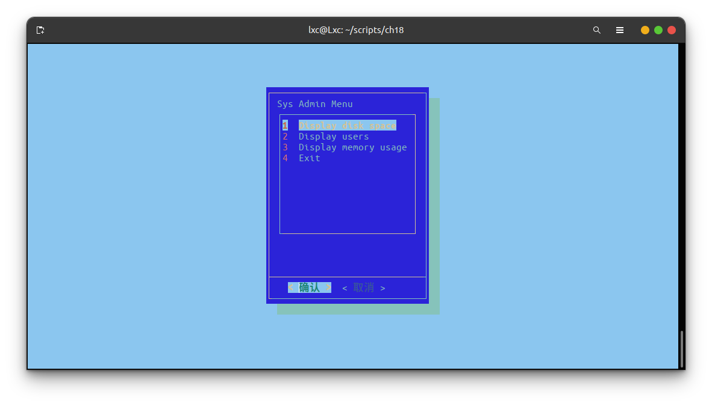
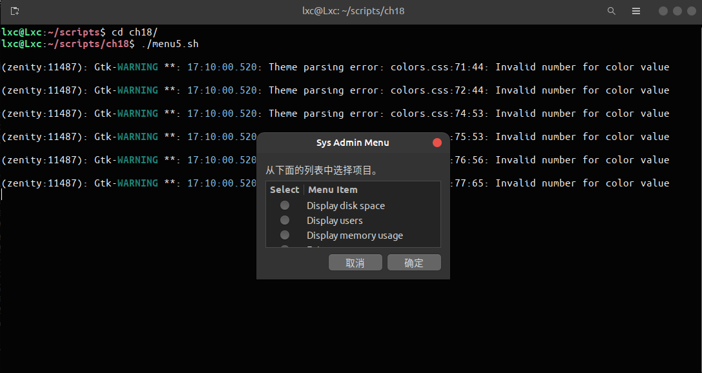

# ch18 图形化桌面环境中的脚本编程

本章将深入介绍一些可以为交互式脚本增添活力的方法，让它们看起来不再那么古板。

## 1. 创建文本菜单

菜单式脚本通常会清空显示区域，然后显示可用的菜单项列表。用户可以按下与每个菜单项关联的字母或数字来选择相应的选项。  
shell脚本菜单的核心是 `case` 命令（参见第12章）。`case` 命令会根据用户在菜单上的选择来执行相应的命令。

### *1. 创建菜单布局*

创建菜单的第一步显然是确定在菜单上显示的元素以及想要显示的布局方式。  
在创建菜单之前，最好先清除屏幕上已有的内容。`clear` 命令使用终端会话的终端设置信息（`clear` 命令会查看由环境变量 *TERM* 给出的终端类型，然后在 *terminfo* 数据库中确定如何清除屏幕上的内容，参见   *man clear*）来清除屏幕上的文本。运行 `clear` 命令之后，可以使用 `echo` 命令来显示菜单。  
在默认情况下， `echo` 命令只显示可打印文本字符。要在 `echo` 命令中包含非可打印字符（制表符、换行符等），必须加入 `-e` 选项。

*来个例子：*

```bash
lxc@Lxc:~/scripts/ch18$ echo -e "1.\tDisplay disk space"
1.      Display disk space
```

### *2. 创建菜单函数*

shell脚本菜单作为一项独立的函数实现起来更为容易。这样你就能创建出简洁、准确且容易理解的 `case` 命令了。为此，你要为每个菜单项创建单独的shell函数。创建菜单函数的第一步是确定脚本要实现的功能，然后将这些功能以函数的形式放在代码中。  
通常我们会为还没有实现的函数创建一个 **桩函数** 。桩函数既可以是一个空函数，也可以只包含一个 `echo` 语句，用于说明最终这里需要什么内容。

*来个例子：*

```bash
function diskspace {
    clear
    echo "This is where the diskspace commands will go"
}
```

这个桩函数允许在实现某个函数的同时，菜单仍能正常操作，无须等到写出所有函数之后才让菜单投入使用。你会注意到，函数从 `clear` 命令开始。这是为了能在一个干净的屏幕上执行函数，让它不受原先菜单的干扰。  
将菜单布局本身作为一个函数来创建，有助于制作shell脚本菜单：

```bash
function menu {
    clear
    echo
    echo -e "\t\tSys Admin Menu\n"
    echo -e "\t1. Display disk space"
    echo -e "\t2. Display logged on users"
    echo -e "\t3. Display memory usage"
    echo -e "\t0. Exit program\n\n"
    echo -en "\t\tEnter option: "
    read -n 1 option
}
```

这样，任何时候，你都能调用 *menu* 函数来重现菜单。

### *3. 添加菜单逻辑*

现在你已经创建了菜单布局和 *menu* 函数，只需创建程序逻辑将二者结合起来即可。前面提到过，这要使用 `case` 命令。下面展示了菜单中 `case` 命令的典型用法：

```bash
menu
case $option in 
0) 
    break;;
1)
    diskspcae;;
2)
    whoseon;;
3)
    memusage;;
*)
    clear
    echo "Sorry, wrong  selection";;
esac
```

### *4. 整合shell脚本菜单*

*下面是一个完整的菜单脚本示例：*

[menu1.sh](./menu1.sh)

```bash
#!/bin/bash
# simple script menu

function diskspace {
    clear
    df -k
}

function whoseon {
    clear
    who
}

function menusage {
    clear
    cat /proc/meminfo
}

function menu {
    clear
    echo
    echo -e "\t\tSys Admin Menu\n"
    echo -e "\t1. Display disk space"
    echo -e "\t2. Display logged on users"
    echo -e "\t3. Display memory usage"
    echo -e "\t0. Exit program\n\n"
    echo -en "\t\tEnter option: "
    read -n 1 option
}

while [ 1 ]
do
    menu
    case $option in
    0)
        break;;
    1)
        diskspace;;
    2)
        whoseon;;
    3)
        menusage;;
    *)
        clear
        echo "Sorry, wrong selection";;
    esac
    echo -en "\n\n\t\tHit any key to continue"
    read -n 1 line
done
clear
```

### *5. 使用 `select` 命令*

`select` 命令只需要一个命令就可以创建出菜单，然后获取输入并自动处理。`select` 命令的格式如下：

```bash
select variable in list
do
    commands
done
```

*list* 参数是由空格分隔的菜单项列表，该列表构成整个菜单。`select` 命令会将每个列表项显示成一个带编号的菜单项，然后显示一个由 `PS3` 环境变量定义的特殊提示符，指示用户做出选择。

*来个例子：*

[smenu1.sh](./smenu1.sh)

```bash
#!/bin/bash
# using select in the menu

function diskspace {
    clear
    df -k
}

function whoseon {
    clear
    who
}

function menusage {
    clear
    cat /proc/meminfo
}

PS3="Enter option: "
select option in "Display disk space" "Display logged on users" "Display memory usage" "Exit program"
do
    case $option in 
    "Exit program")
        break;;
    "Display disk space")
        diskspace;;
    "Display logged on users")
        whoseon;;
    "Display memory usage")
        menusage;;
    *)
        clear
        echo "Sorry, wrong selection";;
    esac
done
clear
# output:
lxc@Lxc:~/scripts/ch18$ ./smenu1.sh 
1) Display disk space
2) Display logged on users
3) Display memory usage
4) Exit program
Enter option: 
```

`select` 语句中的所有内容必须作为一行出现。在使用 `select` 命令时，存储在指定变量中的值是整个字符串，而不是跟菜单选项相关联的数字。字符串才是要在 `case` 语句中进行比较的内容。

## 2. 创建文本窗口部件

*dialog* 软件包最早是 Savio Lam 编写的一款小巧的工具，现在由 Thomas E.Dickey 负责维护。  *dialog* 能够用 ANSI 转义控制字符，在文本环境中创建标准的窗口对话框。你可以轻而易举地将这些对话框融入自己的shell脚本中，以实现与用户的交互。本节将介绍 *dialog* 软件包并演示如何在shell脚本中使用它。

### 1. *dialog* 软件包

*dialog* 命令使用命令行选项来决定生成哪种窗口**部件(widget)**。部件是代表某类窗口元素的术语。  *dialog* 软件包目前支持的部件类型如下所示：

|部件名|描述|
| :-----: | :-----------------------------: |
|*calendar*|提供可选择日期的日历|
|*checklist*|显示多个条目，其中每个条目都可以打开或者关闭|
|*form*|构建一个带有标签以及文本字段(可以填写内容)的表单|
|*fselect*|提供一个文件选择窗口来浏览选择文件|
|*gauge*|显示一个进度条，指明已完成的百分比|
|*infobox*|显示一条消息，但不用等待回应|
|*inputbox*|显示一个文本框，以输入一个文本|
|*inputmenu*|提供一个可编辑的菜单|
|*menu*|显示一系列可供选择的菜单项|
|*msgbox*|显示一条消息，要求用户点选OK按钮|
|*pause*|显示一个进度条，指明暂停期间的状态|
|*passwordbox*|显示一个文本框，但会隐藏输入的文本|
|*passworform*|显示一个带标签和隐藏文本字段的表单|
|*radiolist*|提供一组菜单项，但只能选择其中一个|
|*tailbox*|用`tail`命令在滚动窗口中显示文件的内容|
|*tailboxbg*|与*tailbox*一样，但运行在后台|
|*textbox*|在滚动窗口中显示文件的内容|
|*timebox*|提供一个选择小时、分钟和秒钟的窗口|
|*yesno*|提供一条带有选择Yes按钮和No按钮的简单消息|

要在命令行中指定某个特定部件，需要使用双连字符格式：

```bash
dialog --widget parameters
```

其中 *widget* 是表中的部件名，*parameters* 定义了部件窗口的大小以及部件需要的文本。  
每个 *dialog* 部件都提供了两种输出形式。

- 使用 *STDERR*
- 使用退出状态码

*dialog* 命令的退出状态码能显示出用户选择的按钮。如果选择了Yes按钮或OK按钮，*dialog* 命令就会返回退出状态码0。如果选择了Cancel按钮或No按钮，*dialog* 命令就会返回退出状态码1。可以用 `$?` 变量来确定用户选择了 *dialog* 部件中的那个按钮。  
如果部件返回了数据（比如菜单选项），那么 *dialog* 命令会将数据发送到 *STDERR*。*STDERR* 的输出可以重定向到另一个文件或文件描述符：

```bash
dialog --inputbox "Enter your age:" 10 20 2>age.txt
```

该命令会将文本框中输入的文本重定向到 age.txt 文件。

#### *1. msgbox部件*

*msgbox* 部件使用的命令格式如下：

```bash
dialog --msgbox text height width
```

*text* 参数是你想在窗口中显示的字符串。*dialog* 命令会根据由 *height* 参数和 *width* 参数创建的窗口大小来自动换行。如果想在窗口顶部放一个标题，可以使用 `--title` 参数，后面跟上标题文本。

*来个例子：*

```bash
lxc@Lxc:~/scripts/ch18$ dialog --title Testing --msgbox "This is a test" 10 20
```


#### *2. yesno部件*

*来个例子：*

```bash
lxc@Lxc:~/scripts/ch18$ dialog --title "Please answer" --yesno "Is this thing on?" 10 20
lxc@Lxc:~/scripts/ch18$ echo $?
0
# 如果用户选择了No按钮，那么退出状态码为1；如果用户选择Yes按钮，那么退出状态码为0。
```


#### *3. inputbox部件*

*inputbox* 部件为用户提供了一个简单的文本区域来输入文本字符串。*dialog* 命令会将文本字符串发送到 *STDERR*你必须重定向 *STDERR* 来获取用户的输入。如果选择了Cancel按钮，那么 *dialog* 命令的退出状态码为1;否则0。

```bash
lxc@Lxc:~/scripts/ch18$ dialog --inputbox "Enter your age:" 10 20 2>age.txt
lxc@Lxc:~/scripts/ch18$ echo $?
0
```


#### *4. textbox部件*

*textbox* 部件是在窗口显示大量信息的好方法。它会生成一个滚动窗口来显示指定文件的内容。

```bash
lxc@Lxc:~/scripts/ch18$ dialog --textbox /etc/passwd 15 45
```


#### *5. menu部件*

*menu* 部件可以创建一个文本菜单的窗口版本。只要为每个菜单项提供选择标号和文本就行。

```bash
lxc@Lxc:~/scripts/ch18$ dialog --menu "Sys Admin Menu" 20 30 10 1 "Display disk space" 2 "Display users" 3 "Display memory usage" 4 "Exit" 2>test.txt
```

第一个参数 *--menu "Sys Admin Menu"* 定义了菜单的标题，后续两个参数20和30定义了菜单窗口的高和宽，第四个参数定义了一次在窗口中显示的菜单项总数。如果还有更多的菜单项，可以用方向键来滚动显示。



如果用户通过按下标号对应的键来选择了某个菜单项，则菜单项会高亮显示但不会被选定。直到用户用鼠标或者Enter键选择了OK按钮，该菜单项才算最终选定。*dialog* 命令会将选定的菜单项文本发送到 *STDERR*。可以根据需要重定向 *STDERR*。

#### *6. fselect部件*

*命令格式：*

```bash
dialog --title "Select a file" --fselect $HOME/ 10 50 2>file.txt
```


*--fselect* 之后的第一个参数指定了窗口使用的起始目录位置。*fselect* 部件窗口由左侧的目录列表、右侧的文件列表（显示了选定目录下的所有文件）和含有当前选定文件或目录的简单文本框组成。可以手动在文本框中输入文件名，也可以用目录和文件列表来选定（使用空格键选定文件，将其加入文本框中）。

### *2. dialog选项*

除了标准部件，还可以在 *dialog*命令中定制很多不同的选项。我们已经使用过 *--title* 选项，该选项允许设置出现在窗口顶部的部件标题。  
另外还有许多其他选项，可以全面定制窗口的外观和操作。详见书上 P413-415。

### *3. 在脚本中使用dialog命令*

在脚本中使用 *dialog* 时要记住两条规则：

- 如果有Cancel或No按钮，请检查 *dialog* 命令的退出状态码。
- 重定向 *STDERR* 来获取输出值。

[menu3.sh](./menu3.sh)

```bash
#!/bin/bash
# using dialog to create a menu

temp=$(mktemp -t test.XXXXXX)
temp2=$(mktemp -t test2.XXXXXX)

function diskspace {
    df -k > $temp
    dialog --textbox $temp 20 60
}

function whoseon {
    who > $temp
    dialog --textbox $temp 20 50
}

function menusage {
    cat /proc/meminfo > $temp
    dialog --textbox $temp 20 50
}

while [ 1 ]
do
    dialog --menu "Sya Admin Menu" 20 30 10 1 "Display disk space" 2 "Display users" 3 "Display memory usage" 0 "Exit" 2>$temp2
if [ $? -eq 1 ]
then
    break
fi
selection=$(cat $temp2)
case $selection in 
1)
    diskspace;;
2)
    whoseon;;
3)
    menusage;;
0)
    break;;
*)
    dialog --msgbox "Sorry, invalid selection" 10 30
esac
done

rm -f $temp 2> /dev/null
rm -f $temp2 2> /dev/null
```

## 3. 图形化窗口部件

KDE桌面环境和GNOME桌面环境（参见第一章）都扩展了 *dialog* 命令的思路，提供了可以在各自环境中生成 X Window图形化部件的命令。  
本节将介绍 *kdialog* 软件包和 *zenity* 软件包（这句话有一半是假的，你猜），两者分别为KDE桌面和GNOME桌面提供了图形化窗口部件。  

### 1. KDE环境

。。。见书上P417。

### 2. GNOME环境

GNOME图形化环境支持两种流行的可生成标准窗口的软件包。

- gdialog
- zenity

到目前为止，zenity是大多数GNOME桌面Linux发行版中最常见的软件包（在Ubuntu和Centos中默认安装）。

#### *1. zenity部件*

zenity可以使用命令行选项创建不同的窗口部件。下表列出了zenity能够生成的不同部件。  
zenity的命令行程序和kdialog程序和dialog程序的工作方式有些不同，zenity的许多部件类型用额外的命令行选项定义，而不是作为某个选项的参数。

|选项|描述|
| :-------: | :----------------------------------: |
|*--calendar*|显示整月日历|
|*--entry*|显示文本输入对话窗口|
|*--error*|显示错误消息对话窗口|
|*--file-selection*|显示完整的路径和文件名对话窗口|
|*--info*|显示信息对话窗口|
|*--list*|显示多选列表或单选列表对话窗口|
|*--notification*|显示通知图标|
|*--progress*|显示进度条对话窗口|
|*--question*|显示yes/no对话窗口|
|*--scale*|显示一个带有滑动条的比例尺对话窗口，可以选择一定范围内的数值|
|*--text-info*|显示含有文本的文本框|
|*--warning*|显示警告对话窗口|

*来看几个例子：*


当在日历中选择了日期时，zenity命令会将该日期的值发送到 *STDOUT*。


#### *2. 使用zenity*

[menu5.sh](./menu5.sh)



## 4. 实战演练

dialog软件包提供了表单功能，但是相当基础，只允许将多个文本框组合到单个窗口中，以此输入多个数据项。`--form` 选项的格式如下:

```bash
--form text height width formheight [ label y x item y x flen ilen ].....
```

`--form` 选项的各个参数含义如下：

- *text* ：表单顶部的标题
- *height* ：表单窗口的高度
- *width* ：表单窗口的宽度
- *formheight* ：窗口内的表单的高度
- *label* ：表单字段的标签
- *y* ： 表单内的标签或字段的Y坐标
- *x* ： 表单内的标签或字段的X坐标
- *item* ：分配给表单字段的默认值
- *flen* ： 要显示的表单字段的长度
- *ilen* ： 可输入表单字段的最大数据长度

[newemployee.sh](./newemployee.sh)

```bash
#!/bin/bash
temp=$(mktemp -t record.XXXX)

function newrecord {
    dialog --form "Enter new employee" 19 50 0 \
        "Last name " 1 1 "" 1 15 30 0 \
        "First name " 3 1 "" 3 15 30 0 \
        "Address " 5 1 "" 5 15 30 0 \
        "City " 7 1 "" 7 15 30 0 \
        "State " 9 1 "" 9 15 30 0 \
        "Zip " 11 1 "" 11 15 30 0 2>$temp

    last=$(cat $temp | head -1)
    first=$(cat $temp | head -2 | tail -1)
    address=$(cat $temp | head -3 | tail -1)
    city=$(cat $temp | head -4 | tail -1)
    state=$(cat $temp | head -5 | tail -1)
    zip=$(cat $temp | head -6 | tail -1)
    record="INSERT INTO employees (last, first, address, city, state, zip) VALUES 
('$last', '$first', '$address', '$city', '$state', '$zip');"
    echo $record >>newrecords.txt
}

function listrecords {
    dialog --title "New Data" --textbox data.txt 20 50
}

while [ 1 ]; do
    dialog --menu "Employee Data" 20 30 5 \
        1 "Enter new employee" \
        2 "Display records" \
        3 "Exit" 2>$temp

    if [ $? -eq 1 ]; then
        break
    fi

    selection=$(cat $temp)

    case $selection in
    1)
        newrecord
        ;;
    2)
        listrecords
        ;;
    3)
        break
        ;;
    *)
        dialog --msgbox "Invalid selection" 10 30
        ;;
    esac
done

rm -f $temp 2>/dev/null
```


