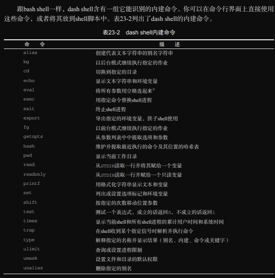
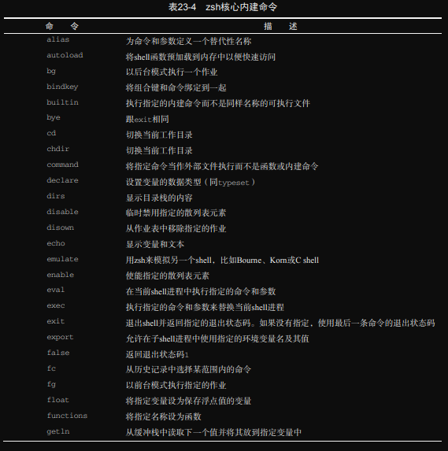
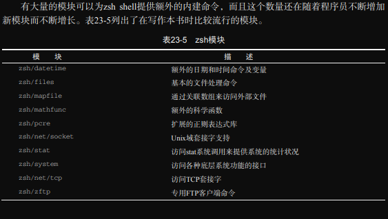

# ch23 使用其他shell

本章讲讲 dash 和 zsh。

## 1. 什么是 dash shell

(我真的不想解释，看书去吧。。。算了还是说说吧)
Debian Linux发行版与其许多衍生产品（比如Ubuntu）一样，使用dash shell作为Linux bash shell的替代品。dash shell是ash shell的直系后裔，是Unix系统中Bourne shell的简易复制品。
Henneth Almquist 这个人为Unix系统开发了Bourne shell的简化版本 Almquist shell，缩写为ash。ash最初的版本体积小，速度奇快，但缺乏许多高级特性，比如命令行编辑和命令历史，这使其很难用作交互式shell。
NetBSD Unix操作系统移植了ash shell，直到今天依然将其作为默认shell。NetBSD开发人员对其进行了定制，增加了一些新特性，使它更接近Bourne shell。ash shell的这个版本也被FreeBSD操作系统用作默认登录shell。
Debian Linux发行版创建了自己的ash shell版本，就叫 Debian shell或 dash。dash复刻了NetBSD版本的ash shell的大多数特性，提供了一些高级命令行编辑功能。你可以认为 dash 是Bourne shell的精简版，因此并不像bash shell那样支持众多特性。
在许多基于Debian的Linux发行版中，dash shell实际上并不是默认shell。由于bash shell在Linux世界广为流行，因此大多数基于Debian的Linux发行版选择将bash shell作为登录shell，而只将dash shell作为安装脚本的快速启动shell，用作发行版安装。
要想知道你的系统属于哪种情况，只需查看 */etc/passwd* 文件中的用户账户信息即可。你可以看看自己的账户的默认交互式shell。比如：

```bash
lxc@Lxc:~/scripts/ch23$ cat /etc/passwd | grep lxc
lxc:x:1000:1000:Lxc,,,:/home/lxc:/bin/bash
```

Ubuntu系统使用bash shell作为默认的交互式shell。要想知道默认的系统shell是什么，只需使用 `ls` 命令查看 */bin* 目录中的sh文件即可：

```bash
lxc@Lxc:~/scripts/ch23$ ls -al /bin/sh
lrwxrwxrwx 1 root root 13 11月  9 21:35 /bin/sh -> /usr/bin/bash
# 如你所见，笔者的Ubuntu系统的默认系统shell是bash。之前已有讲述，我更改了这个软连接。
```

Ubuntu系统使用dash shell作为默认的系统shell。这正是许多问题（这个问题在 [之前](../ch19/README.md#3-实战演练) 讲到过）的根源所在。


## 2. dash shell的特性

尽管bash shell和dash shell均以Bourne shell为样板，但两者之间还是有些差距的。

### *1. dash命令行选项*

dash shell使用命令行选项控制其行为。下表列出了这些选项及其用途。

|选项|描述|
| :----: | :---------------------------------------------------------------------: |
|...|RTFM|
|-a|导出分配给shell的所有变量|
|-c|从特定的命令字符串中读取命令|
|-e|如果是非交互式shell，就在未经测试的命令失败时立即退出|
|-f|显示路径通配符|
|-n|如果是非交互式shell，就读取命令但不执行|
|-u|在尝试扩展一个未设置过的变量时，将错误消息写入 *STDERR*|
|-v|在读取输入时将输入写到 *STDERR*|
|-x|在执行命令时，将每个命令写入 *STDERR*|
|-I|在交互式模式下，忽略输入中的EOF字符|
|-i|强制shell运行在交互式模式下|
|-m|启用作业控制（在交互式模式下默认开启）|
|-s|从 *STDIN* 读取命令（在没有指定读取文件参数时的默认行为）|
|-E|启用Emacs命令行编辑器|
|-V|启用vi命令行编辑器|

`-E` 命令行选项允许使用Emacs编辑器命令来进行命令行文本编辑（参见第10章）。你可以通过 Ctrl 和 Alt 组合键，使用所有的Emacs命令来处理一行中的文本。
`-V` 命令行选项允许使用vi编辑器命令进行命令行文本编辑（参见第10章）。该功能允许用Esc键在普通模式和vi编辑器模式之间切换。当处于vi模式时，可以使用标准的vi编辑器命令（比如，x 用于删除一个字符，i 用于插入文本）。当完成命令行编辑后，必须再次按下Esc键退出vi编辑器模式。

### 2. dash环境变量

dash使用大量的默认环境变量来记录信息，你也可以创建自己的环境变量。本节将介绍这些环境变量以及dash如何处理它们。

#### *1. 默认环境变量*

dash以简洁为目标，其使用的环境变量比bash shell明显要少。在dash shell环境编写脚本时，要考虑到这一点。

dash shell用 `set` 命令来显示环境变量：

```bash
$ set
CHROME_DESKTOP='code-url-handler.desktop'
......
```

#### *2. 位置变量*

除了默认的环境变量，dash shell还为在命令行中定义的参数分配了特殊的变量。下面是dash shell中可用的位置变量：

- $0 :shell脚本的名称。
- $n :第n个位置变量。
- $* :含有所有命令行参数的单个值，参数之间由 IFS 环境变量中的第一个字符分隔；如果没有定义IFS，则由空格分隔。
- $@ :扩展为由所有的命令行参数组成的多个参数。
- $# :命令行参数的总数。
- $? :最近一个命令的退出状态码。
- $- :当前选项标志。
- $$ :当前shell的进程ID（PID）。
- $! :最后一个后台命令的进程ID（PID）。

dash shell的位置变量的用法和bash shell一样，你可以像在bash shell中那样在dash shell脚本中使用位置变量。

#### *3. 用户自定义环境变量*

dash shell还允许你定义自己的环境变量。跟bash一样，可以在命令行中用赋值语句来定义新的环境变量：

```bash
$ testing=10; export testing
$ echo $testing
10
```

如果不用 `export` 命令，那么用户自定义环境变量就只在当前shell或进程中可见。

> dash变量和bash变量之间有一个巨大的差异：dash shell不支持数组。这个特性给高级shell脚本开发人员带来了各种问题。

### *3. dash内建命令*

见书上 p538页




## 3. dash脚本编程

dash shell不能完全支持bash shell的脚本编程功能。为bash shell编写的脚本通常无法在dash shell中运行，这给shell脚本程序员带来了各种麻烦。本节将介绍一些值得留意的差别，以便你的shell脚本能够在dash shell环境中正常运行。

### *1. 创建dash脚本*

可以在shell脚本的第一行指定以下内容：

```bash
#!/bin/dash
```

还可以在这行指定shell命令行选项，参见[23.2.1节](./README.md#1-dash命令行选项)

### 2. 不能使用的特性

由于dash shell只是Bourne shell的一个子集，因此bash shell脚本中有些特性无法在dash shell中使用。这些特性通常称作 **bash流派(bashism)**。本节将简单总结那些在bash shell脚本中习惯使用，但在dash shell环境中无法使用的bash shell特性。

#### *1. 算术运算*

[第11章](../ch11/README.md) 介绍过3种在bash shell脚本中执行数学运算的方法。

- 使用 `expr` 命令： expr operation。
- 使用方括号： $[ operation ]
- 使用双圆括号： $(( operation ))

dash shell支持使用 `expr` 命令和双圆括号进行数学运算，但不支持使用方括号。如果你的脚本中有大量采用方括号的数学运算，那么这可是个问题。

在dash shell脚本中执行数学运算的正确格式是使用双圆括号：

[test1.sh](./test1.sh)

```bash
lxc@Lxc:~/scripts/ch23$ cat test1.sh 
#!/bin/dash
# testing mathematical operations

value1=10
value2=15

value3=$(( $value1 * $value2 ))
echo "The answer is $value3"
# output:
lxc@Lxc:~/scripts/ch23$ ./test1.sh 
The answer is 150
```

#### *2. `test`命令*

虽然dash shell支持 `test` 命令，但务必注意其用法。dash shell版本的 `test` 命令跟bash shell版本略有不同。
bash shell的 `test` 命令使用双等号(==)来测试两个字符串是否相等，而dash shell中的 `test` 命令不能识别用作文本比较的 \== 符号，只能识别 = 符号。如果在bash脚本中使用了 \== 符号，则需要将其换成 \= 符号：

[test2.sh](./test2.sh)

```bash
lxc@Lxc:~/scripts/ch23$ cat test2.sh 
#!/bin/dash
# testing the = comparison

test1=abcde
test2=abcde

if [ $test1 = $test2 ]
then
    echo "They're the same"
else
    echo "They're the different"
fi
lxc@Lxc:~/scripts/ch23$ ./test2.sh 
They're the same
```

#### *3. `function` 命令*

[第17章](../ch17/README.md) 演示过如何在脚本中定义函数。bash shell支持两种定义函数的方法。

- 使用 `function` 语句。
- 只使用函数名。

dash shell不支持 `function` 语句，必须使用函数名和圆括号来定义函数。
如果编写的脚本可能会在dash环境中，就只能使用函数名来定义函数，决不要用 `function` 语句。

[test3.sh](./test3.sh)

```bash
lxc@Lxc:~/scripts/ch23$ cat test3.sh 
#!/bin/dash
# testing functions

func1() {
    echo "This is an example of a function"
}

count=1

while [ $count -le 5 ]
do
    func1
    count=$(( $count + 1 ))

done
echo "This is the end of the loop."
func1
echo "This is the end of script."
# output:
lxc@Lxc:~/scripts/ch23$ ./test3.sh 
This is an example of a function
This is an example of a function
This is an example of a function
This is an example of a function
This is an example of a function
This is the end of the loop.
This is an example of a function
This is the end of script.
```

## 4. zsh shell

另一个流行的shell是 Z shell（称作zsh）。zsh是由 Paul Flastad开发的开源Unix shell。它汲取了所有现存shell的设计理念，增加了许多独有的特性，是为程序员而设计的一款无所不能的高级shell。
下面是zsh shell的一些独有特性：

- 改进的shell选项处理
- shell兼容模式
- 可加载模块

可加载模块是shell设计中最先进的特性。我们在bash 和 dash shell中已经看到过，每种shell都包含一组内建命令，这些命令无须借助外部程序即可使用。内建命令的好处在于执行速度快。shell不必在运行命令前先加载一个外部程序，因为内建命令已经在内存中了，随时可用。
zsh shell提供了一组核心内建命令，比如网络支持和高级数学功能。可以之添加你认为有用的模块。

## 5. zsh shell的组成

本节将带你逐步学习zsh shell的基础知识，介绍可用的内建命令（或是可以通过命令模块添加的命令）以及命令行选项和环境变量。

### *1. shell选项*

大多数shell采用命令行选项来定义shell的行为。zsh shell也不例外，同样提供了相应的选项。你可以在命令行或shell中用 `set` 命令设置shell选项。
下表列出了zsh shell可用的命令行选项。

|选项|描述|
| :--: | :-------------------: |
|-c|只执行指定的命令，然后退出|
|-i|作为交互式shell启动，提供命令行提示符|
|-s|强制shell从 *STDIN* 读取命令|
|-o|指定命令行选项|

`-o` 选项允许设置shell选项来定义shell的各种特性。到目前为止，zsh shell是所有shell中可定制性最强的。有大量的特性可供更改shell环境。shell选项可以分为以下几类。


### 2. 内建命令

本节将介绍核心内建命令以及在写作本书时可用的各种模块。

#### *1. 核心内建命令*

下表列出了可用的核心内建命令。




#### *2. 附加模块*




#### *3. 查看、添加和删除模块*

`zmodload` 命令是zsh模块的管理接口。你可以在zsh shell会话中使用该命令查看、添加或删除模块。
不加任何参数的 `zmodload` 命令会显示zsh shell中当前已安装的模块。

```zsh
lxc@Lxc ~/scripts/ch23 % zmodload 
zsh/complete
zsh/complist
zsh/computil
zsh/main
zsh/parameter
zsh/stat
zsh/terminfo
zsh/zle
zsh/zutil
```

不同的zsh shell实现在默认情况下包含了不同的安装模块，要添加新模块，只需在 `zmodload` 命令行中指定模块名即可：

```zsh
lxc@Lxc ~/scripts/ch23 % zmodload zsh/net/tcp
lxc@Lxc ~/scripts/ch23 % 
```

无显示信息则表明模块已加载成功。再运行一次 `zmodload` 名录令，可以看到新模块出现在已安装模块的列表中。一旦加载了模块，该模块中的命令就成了可用的内建命令。

> **提示：** 将 `zmodload` 命令放入 $HOME/.zshrc 启动文件是一种常见的做法，这样在zsh启动时就会自动加载常用的模块。

## 6. zsh脚本编程

zsh shell的主要目的是为程序员提供一个高级编程环境。

### 1. 数学运算

zsh shell可以让你轻松地执行数学函数。目前，zsh shell在所有数学运算中都提供了对浮点数的全面支持。

#### *1. 执行计算*

zsh shell提供了执行数学运算的两种方法。

1. `let` 命令
2. 双圆括号

在使用 `let` 命令时，应该在算式前后加上双引号，这样才能使用空格：

```zsh
lxc@Lxc ~/scripts/ch23 % let value1="4 * 5.1 / 3.2 " 
lxc@Lxc ~/scripts/ch23 % echo $value1
6.3750000000
```

注意，使用浮点数会有精度问题。要解决这个问题，可以使用 `printf` 命令指定所需的小数点精度。

```zsh
lxc@Lxc ~/scripts/ch23 % printf "%6.3f\n" $value1
6.375
```

第二种方法是使用双圆括号。这种方法结合了两种定义数学运算的方法：

```zsh
lxc@Lxc ~/scripts/ch23 % value1=$((4 * 5.1))
lxc@Lxc ~/scripts/ch23 % (( value2 = 4 * 5.1 ))
lxc@Lxc ~/scripts/ch23 % printf "%6.3f\n" $value1 $value2
20.400
20.400
```

注意，可以将双圆括号放在算式两边（前面加个美元符号）或整个赋值表达式两边。如果将双圆括号放在整个赋值表达式两边的话，那赋值表达式中等号两侧可以有空格（见上面的例子）。两种方式能输出同样的结果。

如果一开始未用 `typeset` 命令声明变量的数据类型，那么zsh shell会尝试自动分配数据类型。这在处理整数和浮点数时很容易出问题。

```zsh
lxc@Lxc ~/scripts/ch23 % value1=10
lxc@Lxc ~/scripts/ch23 % value2=$(( $value1 / 3 ))
lxc@Lxc ~/scripts/ch23 % echo $value2
3.0000000000
```

如果在指定数值时未指定小数部分的话，zsh shell会将其视为整数值并进行整数运算。如果想保证结果是浮点数，则必须指定小数部分：

```zsh
lxc@Lxc ~/scripts/ch23 % value1=10.
lxc@Lxc ~/scripts/ch23 % value2=$(( $value1 / 3. ))
lxc@Lxc ~/scripts/ch23 % echo $value2
3.3333333333
```

#### *2. 数学函数*

zsh shell的数学函数可多可少。默认的zsh shell不含任何特殊的数学函数，但如果安装了zsh/mathfunc模块，那么你将拥有的数学函数绝对比需要的多：

```zsh
lxc@Lxc ~/scripts/ch23 % value1=$(( sqrt(9) ))
zsh: unknown function: sqrt
lxc@Lxc ~/scripts/ch23 % zmodload zsh/mathfunc  
lxc@Lxc ~/scripts/ch23 % value1=$(( sqrt(9) ))
lxc@Lxc ~/scripts/ch23 % echo $value1
3.
```

> **提示：** zsh支持大量的数学函数。要查看 zsh/mathfunc 模块提供的所有数学函数的清单，可参见zshmodules的手册页。

### *2. 结构化命令*

zsh shell为shell脚本提供了常用的结构化命令。

- `if-then-else` 语句
- `for` 循环（包括C语言风格的）
- `while` 循环
- `until` 循环
- `select` 语句
- `case` 语句

zsh shell中的结构化命令采用的语法和你熟悉的bash shell一样。zsh shell还提供了另一个结构化命令 `repeat`。该命令格式如下：

```zsh
repeat param
do
    commands
done
```

`param` 参数必须是一个数值，或是能计算出一个值的数学运算。然后，`repeat` 命令就会执行那么多次指定的命令：

```zsh
lxc@Lxc ~/scripts/ch23 % cat test4.sh 
#!/bin/zsh
# using the repeat command

value1=$(( 10 / 2 ))
repeat $value1
do
    echo "This is a test"
done
# output:
lxc@Lxc ~/scripts/ch23 % ./test4.sh 
This is a test
This is a test
This is a test
This is a test
This is a test
```

### *3. 函数*

zsh shell支持使用 `function` 命令或函数名加圆括号的形式来创建自定义函数：

```zsh
lxc@Lxc ~/scripts/ch23 % function functest1 {
lxc@Lxc ~/scripts/ch23 function> echo "This is test1 function"
lxc@Lxc ~/scripts/ch23 function> }
lxc@Lxc ~/scripts/ch23 % function functest2 {
lxc@Lxc ~/scripts/ch23 function> echo "This is the test2 function"
lxc@Lxc ~/scripts/ch23 function> }
lxc@Lxc ~/scripts/ch23 % functest1 
This is test1 function
lxc@Lxc ~/scripts/ch23 % functest2
This is the test2 function
```

跟bash shell函数一样（参见[第17章](../ch17/README.md)），你可以在shell脚本中定义函数，然后使用全局变量或向函数传递参数。

## 7. 实战演练

zsh shell的tcp模块尤为实用。该模块允许创建TCP套接字，侦听传入的连接，然后与远程系统建立连接。这是在shell脚本之间传输数据的绝佳方式。

首先，打开shell窗口作为服务器。启动zsh，加载tcp模块，然后定义TCP套接字的侦听端口号。

```zsh
lxc@Lxc:~/scripts$ zsh
lxc@Lxc ~/scripts % zmodload zsh/net/tcp
lxc@Lxc ~/scripts % ztcp -l 8888
lxc@Lxc ~/scripts % listen=$REPLY
lxc@Lxc ~/scripts % ztcp -a $listen
```

`ztcp` 命令的 `-l` 选项指定了监听的TCP端口号（在本例中是8888）。特殊的 `$REPLY` 变量包含与网络套接字关联的文件句柄(file handle)。`ztcp` 命令的 `-a` 选项会一直等待传入连接建立完毕。
现在，打开另一个shell窗口作为客户端，输入下列命令来连接服务端shell（注意客户端shell进入了ch23目录，服务器端shell并没有进入ch23目录，以此作为区分）：

```zsh
lxc@Lxc:~/scripts/ch23$ zsh
lxc@Lxc ~/scripts/ch23 % zmodload zsh/net/tcp
lxc@Lxc ~/scripts/ch23 % ztcp localhost 8888
lxc@Lxc ~/scripts/ch23 % remote=$REPLY
lxc@Lxc ~/scripts/ch23 % 
```

当建立好连接之后，你会在服务器端的shell窗口看到zsh shell命令行提示符。你可以在服务器端将新连接的句柄保存在变量中：

```zsh
lxc@Lxc ~/scripts % remote=$REPLY
```

这样就可以收发数据了。要想发送消息，可以使用 `print` 语句将文本发送到 `$remote` 连接句柄：

```zsh
lxc@Lxc ~/scripts/ch23 % print "This is a test message" >&$remote
```

在另一个shell窗口中，可以使用 `read` 命令接受发送到 `$remote` 连接的句柄，然后使用 `print` 命令将其显示出来：

```zsh
lxc@Lxc ~/scripts % read -r data <&$remote; print -r $data
This is a test message
```

你也可以用同样的方法反向发送数据。

事成之后，使用 `-c` 选项关闭各个系统中对应的句柄。对于服务器端来说，可以使用下列命令：

```zsh
lxc@Lxc ~/scripts % ztcp -c $listen
lxc@Lxc ~/scripts % ztcp -c $remote
```

对于客户端来说，可以使用如下命令：

```zsh
lxc@Lxc ~/scripts/ch23 % ztcp -c $remote
```

你的shell脚本如今已经具备了联网特性，又上了一个新台阶。